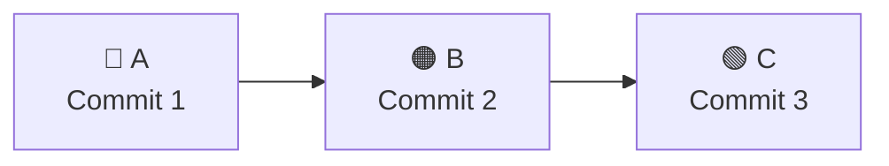
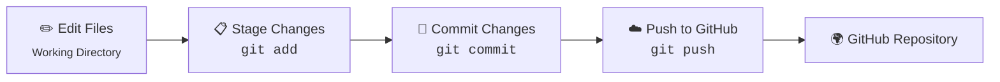

<div align="center">

# 🚀 Git & GitHub Handbook
### The Complete Beginner's Guide — Master Version Control, Collaborate Better, Code with Confidence


</div>

---

## 📑 Table of Contents

1. [Introduction](#1-introduction)
2. [What is Git?](#2-what-is-git)
3. [Understanding Version Control Systems](#3-understanding-version-control-systems)
4. [Git vs GitHub](#4-git-vs-github)
5. [Installing Git](#5-installing-git)
6. [How Git Works](#6-how-git-works)
7. [Hands-on Git](#7-hands-on-git)
8. [Git Scenario 1: Single User Setup](#8-git-scenario-1-single-user-setup)
9. [Ignoring Files](#9-ignoring-files)
10. [Tracking Empty Directories](#10-tracking-empty-directories)
11. [Branches](#11-branches)
12. [Merge Conflict](#12-merge-conflict)
13. [Stashing in Git](#13-stashing-in-git)
14. [Git Tags](#14-git-tags)
15. [Git Rebase](#15-git-rebase)
16. [Using GitHub to Host Our Repositories](#16-using-github-to-host-our-repositories)
17. [GitHub Desktop](#17-github-desktop)
18. [Using Git in VS Code](#18-using-git-in-vs-code)
19. [Git Scenario 2: Multi-User Setup](#19-git-scenario-2-multi-user-setup)
20. [Modern Workflow](#20-modern-workflow)
21. [Conclusion](#21-conclusion)

---

## 1. Introduction

# Welcome to the **Git & GitHub Handbook** 👋

Learning Git doesn’t have to be hard. This handbook is a **beginner-friendly, practical guide** to help you understand **Git and GitHub from scratch** without the jargon.

If you’ve ever asked **“What is Git?”**, **“What is a commit?”**, or **“How do developers work together on GitHub?”**, you’re in the right place. You’ll find clear explanations, visual diagrams, real-world examples, and copy-paste-ready commands to make learning easy.

By the end of this handbook, you’ll know how to:

- 🚀 Track and manage code with Git.
- 🌿 Create and use branches.
- 🔀 Merge changes and fix conflicts.
- 🤝 Collaborate with others on GitHub.
- 💼 Use real-world Git workflows.

Whether you’re a **student**, **self-taught developer**, **open-source contributor**, or **preparing for your first tech job**, this handbook is for you.

You can use this handbook in two ways:

- 📖 **Learn step by step** by reading it from start to finish.
- 🔍 **Use it as a reference** by jumping to any of the **topics** in the [Table of Contents](#-table-of-contents) whenever you need a quick refresher.

> **⭐ Found this handbook helpful?** Consider starring the repository to support the project, and feel free to open a pull request if you'd like to improve it for the community.

---

## 2. What is Git?

**Git** is a version control system that tracks changes to files over time. It helps you save progress, return
to earlier versions, and work without losing important edits.

Think of Git as a timeline for your project. Each saved point is called a commit. You can review
changes, compare versions, and undo mistakes when needed.

## 📌 A Commit Timeline



> In the above diagram, each letter is one commit. New commits extend the line to the right.

Git is often used with **GitHub**, which gives you a place to store repositories online, share code, and collaborate with others.

## 🚀 Use Git When You Want

<table>
<tr>
<td width="50%">

### 01 📜 Keep a Complete History

A clear history of changes made to your project over time

</td>

<td width="50%">

### 02 💾 Create Reliable Backups

Safe backup points for your work that you can return to anytime.

</td>
</tr>

<tr>
<td>

### 03 🤝 Collaborate with Teams

Easier teamwork when multiple people work on the same project.

</td>

<td>

### 04 🔄 Undo Mistakes Safely

The ability to undo mistakes without losing important edits.

</td>
</tr>
</table>

## 🔄 Visualizing a Simple Git Workflow

| Step | Action | Git Command |
|:---:|:--------|:-----------|
| ✏️ | **Edit Files** | Working Directory |
| ⬇️ | **Stage Changes** | `git add` |
| 💾 | **Create Commit** | `git commit` |
| ☁️ | **Push to GitHub** | `git push` |
| 🌍 | **Repository Updated** | GitHub |



---

## 3. Understanding Version Control Systems

Version Control Systems (VCS) help you **track changes** to your files over time. Instead of creating multiple copies like `project-final-v2-latest.zip`, a VCS keeps a complete history of your project.

With version control, you can:

- 📝 Save snapshots of your project.
- 🔍 Compare different versions.
- ⏪ Restore previous versions when needed.
- 🤝 Collaborate with others without overwriting each other's work.

---

## 🏛️ Centralized Version Control System (CVCS)

In a **Centralized Version Control System**, there is **one central server** that stores the official version of the project.

Developers:
1. Connect to the central server.
2. Download (check out) the project.
3. Make changes.
4. Upload (check in) their changes back to the server.

### Examples

- SVN (Subversion)
- CVS (Concurrent Versions System)

### ⚠️ Drawbacks

- ❌ Requires access to the central server.
- ❌ If the server goes down, collaboration stops.
- ❌ The server becomes a **single point of failure**.

---

## 🌐 Distributed Version Control System (DVCS)

In a **Distributed Version Control System**, every developer has a **complete copy of the repository**, including its entire history.

Instead of relying on a central server, developers can:

1. Clone the repository.
2. Commit changes locally.
3. Sync with a remote repository whenever they're ready.

### Examples

- Git
- Mercurial

### ✅ Benefits

- 💻 Work completely offline.
- ⚡ Faster operations.
- 🔒 Every developer has a backup of the project history.
- 🌿 Supports powerful workflows like branching and merging.

---

# ⚖️ Centralized vs Distributed

| Feature | 🏛️ Centralized VCS | 🌐 Distributed VCS |
|----------|-------------------|--------------------|
| 📜 Project History | Stored only on the server | Stored on every developer's machine |
| 💻 Offline Work | Limited | Full support |
| 💾 Backup | Only the server has the complete history | Every clone acts as a backup |
| ⚠️ Failure Risk | Single point of failure | Multiple copies reduce risk |
| ⚡ Performance | Slower (depends on server) | Faster local operations |

---

## 📊 Visual Comparison

```text
🏛️ Centralized Version Control

            ☁️ Central Server
          ┌─────────────────┐
          │ Project History │
          └────────┬────────┘
          ┌────────┼────────┐
          ▼        ▼        ▼
      👨‍💻 Dev A 👩‍💻 Dev B 👨‍💻 Dev C

• One central repository
• Server failure affects everyone
```

```text
🌐 Distributed Version Control (Git)

👨‍💻 Dev A      👩‍💻 Dev B      👨‍💻 Dev C
┌──────────┐  ┌──────────┐  ┌──────────┐
│ Full Repo│  │ Full Repo│  │ Full Repo│
│ + History│  │ + History│  │ + History│
└────┬─────┘  └────┬─────┘  └────┬─────┘
     └─────────────┼─────────────┘
                   ▼
          ☁️ Remote Repository
```

---

# 🚀 Why Git Uses a Distributed Model

Git was created by **Linus Torvalds** in **2005** to manage the development of the **Linux Kernel**, one of the world's largest open-source projects.

A distributed architecture allows Git to provide:

- ⚡ Faster performance
- 💾 Reliable backups
- 🌿 Easy branching
- 🔀 Powerful merging
- 💻 Offline development
- 🤝 Efficient collaboration

---

## 📝 In Short

> 🏛️ **Centralized VCS**
>
> - One central server stores the project.
> - Requires server access.
> - Single point of failure.

> 🌐 **Distributed VCS**
>
> - Every developer has the complete repository.
> - Works offline.
> - Multiple backups exist automatically.

> ⭐ **Git is a Distributed Version Control System (DVCS)** designed for speed, reliability, and collaboration.

---

## 4. Git vs GitHub

**Git** is the version control tool that runs on your computer. It tracks changes, creates commits, and manages branches.

**GitHub** is a website that hosts Git repositories online. It adds collaboration features like pull requests,
issues, and code review.

They are **not** the same thing — Git is the engine, GitHub is one of several places you can park it.

| | Git | GitHub |
|---|---|---|
| What it is | Tool | Hosting service |
| Runs on | Your computer | The cloud |
| Needs internet | No (for local work) | Yes (to sync) |
| Stores history | Yes | Yes (as a remote copy) |

**Git repository** = your project folder + hidden `.git` folder holding all history.
**Alternatives to GitHub:** GitLab, Bitbucket, Codeberg — all work with Git underneath.

---

## 5. Installing Git

| Platform | Command / Steps |
|---|---|
| 🪟 Windows | Download from [git-scm.com](https://git-scm.com), or `winget install --id Git.Git -e --source winget` |
| 🍎 macOS | `xcode-select --install` or `brew install git` |
| 🐧 Linux (Debian/Ubuntu) | `sudo apt update && sudo apt install git` |

**Verify it worked:**
```bash
git --version
# git version 2.x.x
```

You can use Git via the **Command Line** (full control), **VS Code** (built-in panel), or **GitHub Desktop** (visual UI) — all three run the same Git commands underneath.

---

## 6. How Git Works

Git moves your changes through **four areas** before they reach GitHub:

```
📁 Working Dir  ──git add──►  📋 Staging Area  ──git commit──►  💾 Local Repo  ──git push──►  ☁️ Remote Repo
```

| Area | What it means |
|---|---|
| **Working Directory** | Your files on disk — edit freely here |
| **Staging Area** | A holding zone for what you want in the next commit |
| **Local Repository** | Where commits are saved permanently on your machine |
| **Remote Repository** | The copy on GitHub |

---

## 7. Hands-on Git

**Basic checks:**
```bash
git --version
git init          # start tracking a folder
git status        # see what's changed
```

**Set your identity (once per machine):**
```bash
git config --global user.name "Your_Name"
git config --global user.email "Your_Email"
```

### 🔑 The BIG 4 Commands
```bash
git init                      # start a repo
git status                    # check current state
git add <filename>            # stage a file (space-separate multiple)
git commit -m "Commit_Message"  # save a snapshot
```

**More everyday commands:**
```bash
git log                   # full history
git log --oneline         # compact history
git add .                 # stage everything
git restore --staged <filename>  # unstage a file
```

---

## 8. Git Scenario 1: Single User Setup

The simplest end-to-end loop for working solo:

```bash
git init
# ...edit files...
git status
git add .
git commit -m "Meaningful message"
# repeat, then anytime:
git log --oneline
```

That's the entire cycle — **edit → stage → commit → review** — no branches or collaborators needed yet.

---

## 9. Ignoring Files

| File | Purpose |
|---|---|
| `.gitignore` | Lists files/folders Git should **never track** (secrets, `node_modules/`, build output, OS junk) |
| `.gitkeep` | A placeholder to make Git track an otherwise-empty folder |

```gitignore
# .gitignore example
.env
__pycache__/
*.pyc
.DS_Store
dist/
```

```bash
# already tracked before adding to .gitignore?
git rm --cached filename
git commit -m "stop tracking filename"
```

---

## 10. Tracking Empty Directories

Git only tracks **files**, never empty folders. To keep an empty folder (like `logs/`) in your repo:

```bash
mkdir logs
touch logs/.gitkeep
git add logs/.gitkeep
```

---

## 11. Branches

A branch = an independent line of development. `main` is the default branch.

```
A─B─C   main
     \
      D─E   feature/search
```

```bash
git branch <branchname>      # create
git branch                   # list (check current)
git switch <branchname>      # move onto it
git merge <branchname>       # merge INTO current branch
git branch -d <branchname>   # delete after merging
```

> 🧠 **Stuck in Vim?** Press `Esc`, then type `:wq` and hit Enter to save & quit.

---

## 12. Merge Conflict

```bash
git switch -c <branchname>   # create + switch in one step
git merge <branchname>
```

A **conflict** happens when both branches changed the *same lines*. Git marks it:

```
<<<<<<< HEAD
your version
=======
their version
>>>>>>> feature/search
```

Fix it manually, remove the markers, then:
```bash
git add filename.py
git commit -m "resolve merge conflict"
```

**Stuck? Abort and start over:**
```bash
git merge --abort
```

---

## 13. Stashing in Git

Temporarily park uncommitted work so you can switch tasks:

```bash
git stash                          # save current changes
git stash push -m "wip on login"   # save with a label
git stash list                     # see all stashes
git stash pop                      # restore + remove from list
git stash apply                    # restore + keep in list
```

> 💡 If `git log --oneline` opens a scrollable pager, press `q` to exit.

---

## 14. Git Tags

Tags mark a **fixed point** in history — usually a release. Unlike branches, they don't move.

```bash
git tag v1.0.0                              # lightweight tag
git tag -a v1.0.0 -m "first stable release" # annotated tag (recommended)
git push origin v1.0.0                      # push a tag
git push origin --tags                      # push all tags
```

| Type | Use case |
|---|---|
| Lightweight | Quick pointer, no metadata |
| Annotated | Stores author, date, message — best for releases |

---

## 15. Git Rebase

Rebase replays your commits on top of another branch, avoiding an extra merge commit and keeping history **linear**.

```
Before:  A─B─E (main)     A─B─E─C'─D' (feature, after rebase)
              \  C─D (feature)
```

```bash
git switch feature/search
git rebase main
```

| | Merge | Rebase |
|---|---|---|
| History | Preserves branch structure | Linear, cleaner |
| Merge commit | Yes | No |
| Safe on shared branches | ✅ Yes | ⚠️ No |

> ⚠️ Only rebase branches **you alone** work on — never rebase commits already pushed and shared.

---

## 16. Using GitHub to Host Our Repositories

1. Sign up at [github.com](https://github.com).
2. Create a repository (with an optional **README.md** — GitHub's "front door" for your project).

```bash
git clone <URL>                        # download a repo (public: easy; private: needs SSH key)
git remote add origin <URL>            # connect local repo to GitHub
git remote -v                          # see connected remotes
git branch -M main                     # rename branch to main
git config --global init.defaultBranch main  # set default for all new repos
git push origin main                   # upload your commits
git pull                               # download + merge remote changes
git fetch                              # download without merging
```

- **origin** → the default nickname for your remote URL
- **main** → the default primary branch name

---

## 17. GitHub Desktop

A free **GUI for Git and GitHub** — clone, commit, branch, push, and pull with buttons instead of commands.

- 🌐 Public repos are viewable by anyone, even in incognito. Private repos show a 404 to outsiders.
- **Pull Request (PR):** a request to merge someone's proposed changes into your project.
- **Forking:** create your own copy of someone else's repo to freely edit, then open a PR back to contribute.
- ⭐ **Starring** = GitHub's "like" button.

> 🎯 **Pro tip:** Practice with a friend — create a sandbox repo, push/pull, branch, and open PRs on each other's code.

---

## 18. Using Git in VS Code

- `Ctrl+Shift+G` (Win/Linux) or `Cmd+Shift+G` (Mac) opens the **Source Control** panel.
- Click `+` to stage a file, `-` to unstage, type a message, and hit ✓ to commit.
- Click the sync icon to pull + push in one step.

**Recommended extension — Git Graph:**
```
Extensions → search "Git Graph" → Install
Ctrl+Shift+P → "Git Graph: View Git Graph"
```

---

## 19. Git Scenario 2: Multi-User Setup

**Invite collaborators** via repository Settings, then use **Issues** to track work:

| Field | Purpose |
|---|---|
| Title | Short summary |
| Description | Full details |
| Assignees | Who's responsible |
| Labels | Category (bug, enhancement...) |
| Project / Milestone | Groups issue under bigger goals |
| Development | Links a branch/PR to the issue |

> 💬 Issues work like a social feed — comment, react, and close once resolved.

**Team branch workflow:**
```bash
git checkout -b feature/login       # 1. create & switch to a feature branch
git add .
git commit -m "add login page"      # 2. make changes and commit
git push -u origin feature/login    # 3. push and open a pull request
```

---

## 20. Modern Workflow

- 🤖 **AI-generated commit messages** — many tools (including VS Code) can draft one for you from your diff.
- 🌿 **Branch-per-experiment** — trying 4 different approaches? Make 4 branches, merge only the one that works.

```bash
git switch -c feature/todays-work
git add .
git commit -m "describe each logical step"
git push -u origin feature/todays-work
```

---

## 21. Conclusion

### ✅ Best Practices
- **Present tense commit messages** — `"Fix login bug"`, not `"Fixed login bug"`
- **Meaningful messages** — describe *what* and *why*, not "fixed stuff"
- **Short-lived branches** — merge back to main as soon as it's ready
- **Never push secrets** — no passwords, `.env` files, or API keys (once leaked, rotate them immediately)
- **Always review before committing** — `git status` and `git diff` catch mistakes early

### ⚡ Quick Reference Cheat Sheet

| Command | What it does |
|---|---|
| `git init` | Start a new repository |
| `git clone <url>` | Copy a remote repository |
| `git status` | Check current state |
| `git add .` | Stage all changes |
| `git commit -m "msg"` | Save a snapshot |
| `git log --oneline` | Compact commit history |
| `git branch -a` | List all branches |
| `git switch -c <name>` | Create + switch to a branch |
| `git merge <branch>` | Merge a branch into current |
| `git stash` / `git stash pop` | Park & restore uncommitted work |
| `git push` / `git pull` | Sync with GitHub |
| `git reset --hard HEAD~1` | Undo last commit (⚠️ discards changes) |
| `git revert <commit>` | Safely undo a **pushed** commit |

---

<div align="center">

### 🎉 You now have a complete, practical foundation in Git & GitHub.
**The best way to lock it in: open a terminal right now and try every command above.**

</div>
