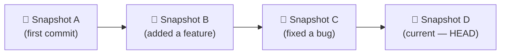
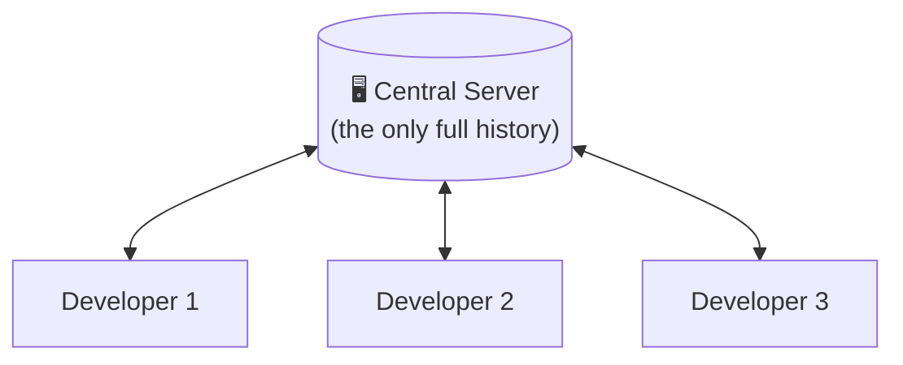
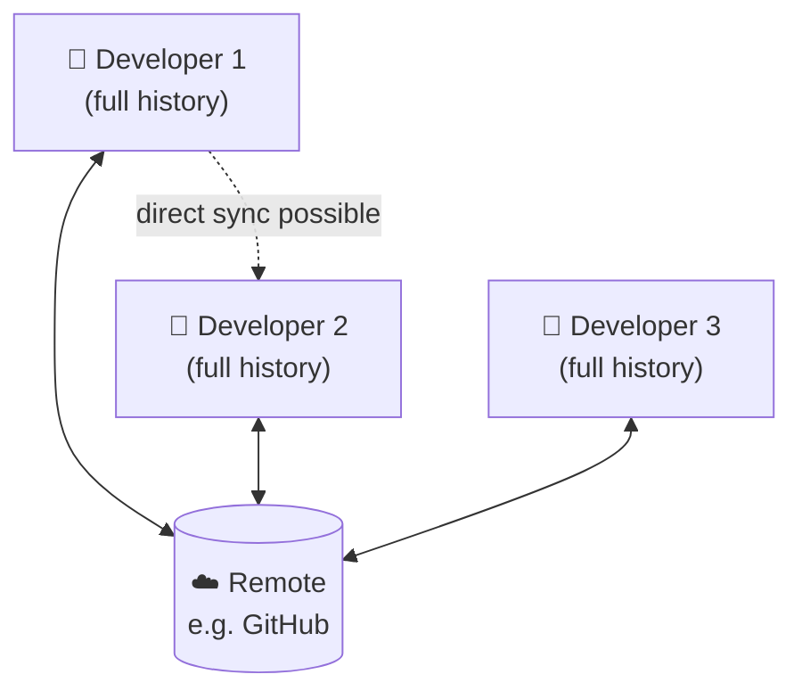
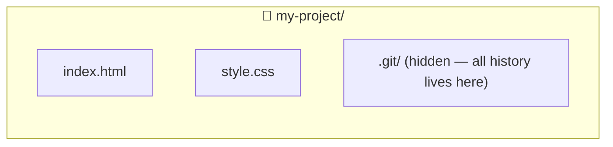
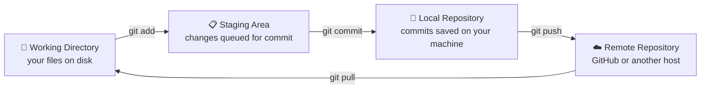
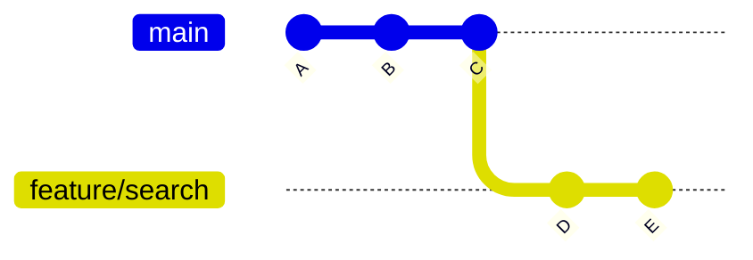
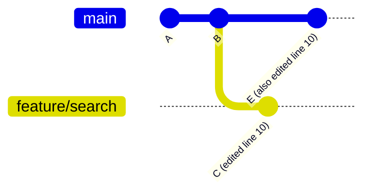
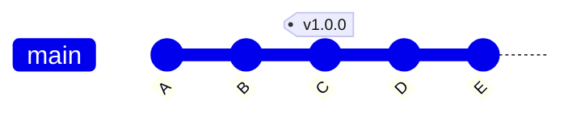

# Git & GitHub Handbook
### A Beginner-to-Professional Guide

> Built from your own notes, structured for clarity, and written so a complete beginner can follow along.

---

## Chapter 1 — Introduction

### 🎯 Learning Objective

By the end of this chapter, you will understand:

- What this handbook will teach you, chapter by chapter
- Why Git and GitHub are considered "must-know" skills for any developer
- How the book is structured so you always know what's coming next
- The mindset you need before touching your first Git command

---

### 🟢 Beginner Explanation

If you have never used Git before, welcome — this handbook assumes **zero prior knowledge**.

Imagine you are writing a story in a text file. Every day you make changes: you add a paragraph, delete a sentence, rewrite the ending. Without any tool to track this, you'd end up with a folder full of files named `story_final.txt`, `story_final_v2.txt`, `story_ACTUAL_final.txt` — and eventually, total confusion about which one is correct.

**Git solves exactly this problem.** It is a tool that remembers every version of your work, lets you jump back to any point in time, and lets multiple people work on the same project without overwriting each other's changes.

**GitHub**, which you will meet in later chapters, is a website built on top of Git. It lets you store your project online, share it with the world, and collaborate with other developers.

---

### 💡 Why This Handbook Exists

Most people learn Git by memorizing commands without understanding *why* those commands exist. That approach works for a week and then falls apart the first time something goes wrong — a merge conflict, an accidental deletion, or a messy commit history.

This handbook takes a different approach:

- Every command is explained with the **problem it solves**, not just its syntax.
- Every concept comes with a **real-world analogy** so it sticks in memory.
- Every chapter ends with a **quiz, a practice task, and interview questions**, so you're not just reading — you're preparing for real use.

---

### 🌍 Real World Analogy

Think of Git like the **"Save Game"** feature in a video game.

- Every time you reach a safe checkpoint, you save your progress (this is a **commit**).
- If you make a bad decision later, you can reload an earlier save (this is **checking out** an old commit).
- If you want to try a risky strategy without losing your main progress, you open a **new save slot** (this is a **branch**).
- If your friend is playing the same game and wants to share their progress with you, they upload their save file to a shared server (this is **GitHub**).

Keep this analogy in mind — it will make almost every Git concept in this book feel familiar instead of foreign.

---

### 🧭 Your Learning Roadmap

This handbook is organized so that each chapter builds on the last. Here is what's ahead:

| # | Chapter | What You'll Be Able to Do |
|---|---------|----------------------------|
| 2 | What is Git? | Explain Git's purpose in plain language |
| 3 | Centralized vs Distributed VCS | Understand why Git works the way it does |
| 4 | Git vs GitHub | Stop confusing the tool with the platform |
| 5 | Installing Git | Get Git running on your machine |
| 6 | How Git Works | Understand the four areas Git moves your files through |
| 7 | Hands-on Git | Run your first real Git commands |
| 8 | Single User Setup | Use Git confidently on a solo project |
| 9 | Ignoring Files | Keep secrets and junk files out of your repository |
| 10 | Tracking Empty Directories | Handle Git's one quirky limitation |
| 11 | Branches | Work on features without breaking your main code |
| 12 | Merge Conflicts | Resolve conflicts calmly instead of panicking |
| 13 | Stashing | Pause your work and switch tasks instantly |
| 14 | Git Tags | Mark official release points in your history |
| 15 | Git Rebase | Keep a clean, linear project history |
| 16 | Hosting on GitHub | Push your code online and manage repositories |
| 17 | GitHub Desktop | Use Git visually, without the terminal |
| 18 | Git in VS Code | Manage Git without leaving your editor |
| 19 | Multi-User Setup | Collaborate with a real team using issues and PRs |
| 20 | Modern Workflow | Use Git effectively in an AI-assisted coding world |
| 21 | Conclusion & Best Practices | Walk away with professional-grade habits |

```
Introduction ──► Git Fundamentals ──► Branching & History ──► GitHub ──► Team Collaboration ──► Professional Habits
```

---

### 🛠 The Tools You'll Use

You don't need anything advanced to follow this handbook. Over the coming chapters you'll get comfortable with:

| Tool | Purpose |
|------|---------|
| **Git Bash / Terminal** | Where you'll type Git commands directly |
| **GitHub** | Where your code lives online |
| **VS Code** | Your code editor, with built-in Git support |
| **GitHub Desktop** | A visual alternative to typing commands |

You will learn all four — starting with the terminal, since understanding the actual commands makes the visual tools far easier to use later.

---

### 💡 Tips Before You Start

- Don't try to memorize every command on the first read. Git becomes natural through repetition, not memorization.
- Type the commands yourself instead of copy-pasting. Muscle memory matters more than you'd expect.
- It's completely normal to feel confused the first time you hit a merge conflict. Chapter 12 exists for exactly that moment.

---

### ⚠️ A Word of Caution

Git is very hard to break permanently — almost every mistake is recoverable — but a few commands (like `git reset --hard` or force-pushing) can discard work if used carelessly. This handbook will clearly flag those commands with a warning box whenever they appear, so you'll always know when to slow down.

---

### ❌ Common Mistakes Beginners Make (Before They Even Start)

- **Skipping the fundamentals** and jumping straight to GitHub — this leads to confusion later, because GitHub is built entirely on Git concepts.
- **Avoiding the terminal entirely** — visual tools are great, but understanding the underlying commands makes troubleshooting far easier.
- **Being afraid to experiment** — Git is designed to be safe to experiment with. Mistakes are part of learning it.

---

### ✅ Best Practices

- Follow the chapters in order the first time through — each one assumes you understand the last.
- Actually create a practice folder on your computer and follow along with every command.
- Revisit the Quick Summary and Cheat Sheet sections whenever you need a fast refresher.

---

### 🔁 Quick Summary

- Git tracks changes to your project over time, like a save-game system for code.
- GitHub is a website that hosts Git repositories online and adds collaboration features.
- This handbook moves from fundamentals → branching → GitHub → team workflows → professional habits.
- You'll use the terminal, GitHub, VS Code, and GitHub Desktop throughout the book.
- Almost every Git mistake is recoverable — so experiment freely as you learn.

---

### ❓ Mini Quiz

1. What problem does Git primarily solve for developers?
   - A) Making code run faster
   - B) Tracking changes to files over time
   - C) Designing user interfaces
   - D) Compiling code into an executable

2. What is GitHub, in relation to Git?
   - A) A programming language
   - B) A replacement for Git
   - C) A website that hosts Git repositories and adds collaboration features
   - D) A code editor

3. In the "save game" analogy, what does a Git **branch** represent?
   - A) Deleting your progress
   - B) A new save slot to try something risky without affecting your main progress
   - C) Sharing your game with a friend
   - D) Uninstalling the game

4. True or False: Most Git mistakes are permanent and cannot be undone.
   - A) True
   - B) False

5. According to this handbook, what is the recommended way to move through the chapters the first time?
   - A) Randomly, based on interest
   - B) In order, since each chapter builds on the last
   - C) Only the chapters about GitHub
   - D) Skip straight to the cheat sheet

**Answer Key:** 1-B, 2-C, 3-B, 4-B, 5-B

---

### 🛠 Practice Task

Before moving to Chapter 2, do this:

1. Create a new folder on your computer called `git-practice`.
2. Open it in VS Code (or any editor you're comfortable with).
3. Create a plain text file inside it called `notes.txt` and write one sentence describing why you want to learn Git.

You won't use Git commands on it yet — this folder will become your hands-on playground starting in Chapter 7.

---

### 💼 Interview Questions

1. In your own words, what is version control and why does it matter in software development?
2. What is the difference between a tool like Git and a platform like GitHub?
3. Why might a team choose to use Git even for a small, solo project?

---

*End of Chapter 1.*

---

## Chapter 2 — What is Git?

### 🎯 Learning Objective

By the end of this chapter, you will be able to:

- Define Git accurately, in your own words
- Explain what problem Git was built to solve
- Describe how Git actually stores your project data
- Understand why Git became the industry-standard tool almost everywhere

---

### 🟢 Beginner Explanation

**Git is a version control system (VCS)** — a piece of software that tracks changes to files over time.

That's the textbook definition. In practice, it means Git constantly answers three questions for you:

1. **What changed?** — Git can show you exactly which lines were added, edited, or removed.
2. **When did it change?** — Every change is timestamped and attributed to whoever made it.
3. **Can I go back?** — Yes. At any point, you can return to any earlier version of your project.

Git runs entirely on **your own computer**. You don't need the internet to use it — it only becomes "online" once you connect it to a platform like GitHub, which you'll meet in Chapter 4.

---

### 💡 Why Git Exists

Git was created in **2005 by Linus Torvalds**, the creator of the Linux operating system kernel. At the time, the Linux project had grown to include thousands of contributors around the world, and the version control tools available simply weren't fast or reliable enough to handle that scale.

Torvalds set out to build a tool with three non-negotiable goals:

| Goal | What It Means in Practice |
|------|----------------------------|
| **Speed** | Even huge projects with years of history stay fast to work with |
| **Data integrity** | Every piece of history is checksummed, so corruption or tampering is detectable |
| **Distributed by design** | Every contributor has a full copy of the project's history, not just the latest snapshot |

That third point is the big one, and it's why Git behaves so differently from older tools — you'll explore it fully in Chapter 3.

---

### 🌍 Real World Analogy

Think of Git like a **camera that photographs your entire project**, not just the parts that changed.

Some older tools worked like sticky notes — they only remembered *"line 12 changed from X to Y."* Git instead takes a full snapshot of your whole project every time you commit, the way a camera captures an entire scene rather than just the object that moved.

This matters because it means Git can reconstruct any previous version of your project instantly and reliably, without needing to replay a long chain of individual edits.



Each snapshot is called a **commit**. You'll create your first one in Chapter 7.

---

### 📝 Practical Example

Imagine you're building a simple website:

- **Monday:** You create `index.html`. Git can remember this exact state forever.
- **Tuesday:** You add a navigation bar. Git creates a new snapshot — but Monday's version still exists.
- **Wednesday:** You accidentally break the layout. Instead of panicking, you simply tell Git: *"show me Tuesday's snapshot."*

No manual backups, no `website_v2_final` folders — Git already remembers every version for you.

---

### 🧩 What Git Actually Tracks

It helps to know, at a high level, what's inside a Git-tracked project:

| Concept | Plain-English Meaning |
|---------|------------------------|
| **Commit** | A saved snapshot of your entire project at one point in time |
| **Commit hash (SHA)** | A unique fingerprint identifying that exact snapshot |
| **History** | The full chain of commits, from the first to the most recent |
| **Repository (repo)** | The project folder Git is watching, including all of its history |

You don't need to memorize these yet — each one gets its own dedicated chapter later in the book. This is just so the vocabulary feels familiar going forward.

---

### 💡 Tips

- You'll sometimes hear people say "Git" when they actually mean "GitHub." Chapter 4 will permanently clear up that confusion.
- Git works on any kind of file, not just code — but it works *best* on plain text files, since it can show line-by-line differences clearly.

---

### ⚠️ Warnings

- Git is not automatic. It only remembers what you explicitly tell it to save (via a **commit**). If you never commit, Git has nothing to protect your work with.
- Very large binary files (videos, large images, compiled programs) are not what Git was designed for — it tracks text-based changes most efficiently.

---

### ❌ Common Mistakes

- **Assuming Git backs up automatically.** It doesn't — you have to commit deliberately, a habit you'll build starting in Chapter 7.
- **Confusing Git with GitHub** from the very first day, which makes later chapters harder to follow. Keep them mentally separate: Git = the tool, GitHub = a website built around it.

---

### ✅ Best Practices

- Get comfortable with the idea that Git is *local first* — everything works on your machine even with no internet connection.
- Start thinking of your project's history as an asset, not an afterthought. Professional teams treat commit history as documentation.

---

### 🏢 Industry & Interview Perspective

Git is used by the overwhelming majority of professional software teams today, from solo freelancers to companies running codebases with thousands of contributors. In interviews, being asked *"what is Git?"* is common as a warm-up question — interviewers are checking whether you understand it as a **distributed, snapshot-based system**, not just "a place to save code online" (that's GitHub, and mixing the two up is a common tell that a candidate is still a beginner).

---

### 🔁 Quick Summary

- Git is a distributed version control system created by Linus Torvalds in 2005 for the Linux kernel project.
- It was built for speed, data integrity, and distributed collaboration.
- Git stores full **snapshots** of your project at each commit, not just line-by-line differences.
- Git runs entirely locally — no internet connection required until you connect it to a remote like GitHub.
- Git ≠ GitHub. Git is the tool; GitHub is a platform built on top of it.

---

### ❓ Mini Quiz

1. Who created Git, and for what project?
   - A) Bill Gates, for Windows
   - B) Linus Torvalds, for the Linux kernel
   - C) Mark Zuckerberg, for Facebook
   - D) Guido van Rossum, for Python

2. What does Git store at each commit?
   - A) Only the lines that changed
   - B) A full snapshot of the entire project
   - C) A screenshot of your screen
   - D) A backup of your entire hard drive

3. Which of these is NOT one of Git's core design goals?
   - A) Speed
   - B) Data integrity
   - C) Requiring a constant internet connection
   - D) Distributed collaboration

4. True or False: Git requires an internet connection to create commits.
   - A) True
   - B) False

5. What is a "commit" in Git?
   - A) A saved snapshot of your project at a point in time
   - B) A type of file extension
   - C) A GitHub-only feature
   - D) A merge conflict

**Answer Key:** 1-B, 2-B, 3-C, 4-B, 5-A

---

### 🛠 Practice Task

No commands yet — this is a thinking exercise:

In your `notes.txt` file from Chapter 1, write down, in your own words, the difference between "Git" and "a backup." Try to include the word **snapshot** in your answer. You'll be able to check your understanding against Chapter 6, where this gets explained visually.

---

### 💼 Interview Questions

1. What is Git, and who created it?
2. Why does Git store snapshots instead of just line-by-line differences?
3. What were the three main design goals behind Git's creation?
4. Does Git require an internet connection to function? Why or why not?

---

*End of Chapter 2.*

---

## Chapter 3 — Centralized vs Distributed Version Control Systems

### 🎯 Learning Objective

By the end of this chapter, you will be able to:

- Explain the difference between centralized and distributed version control
- Describe the main weakness of centralized systems
- Explain why Git's distributed design was such a big deal when it launched
- Confidently answer "why does Git work the way it does?" in an interview

---

### 🟢 Beginner Explanation

A **version control system (VCS)** is any tool that tracks changes to files over time. Git is one example, but it isn't the only one — and it isn't even the first. To really understand *why* Git works the way it does, it helps to know what came before it.

There are two broad models of version control:

- **Centralized Version Control** — one single server holds the "official" project. Everyone connects to it to get work done.
- **Distributed Version Control** — every single person has a complete, independent copy of the entire project history on their own machine.

Git belongs to the second category, and that single design decision explains almost everything about how it behaves.

---

### 💡 Why This Distinction Matters

Before Git, tools like **SVN (Subversion)** and **CVS** were extremely common, and they used the centralized model.

**Centralized Version Control:**



In this model, developers "check out" files from the central server, make changes, and "check them back in." The server is the single source of truth — which also makes it a **single point of failure**. If the server goes down, goes offline, or gets corrupted, nobody can commit, and in some cases, nobody can even see the project's history.

**Distributed Version Control:**



In this model, every developer's machine holds a **complete copy** of the project's entire history — not just the current files, but every commit ever made. The "remote" (like GitHub) is really just a convenient, commonly-agreed-upon copy that everyone syncs with. If it disappears, any single developer's machine can restore the whole project, history included.

---

### 🌍 Real World Analogy

Picture two different types of libraries:

- **Centralized model = a single physical library.** Everyone must visit that one building to read a book. If it's closed for renovation, nobody can access anything.
- **Distributed model = everyone owns a personal copy of every book in the library.** You can read, search, and reference anything at home, anytime, with no internet required. Occasionally, you sync with the central library to grab new books others have added, and to share the ones you've written.

Git gives every contributor their own "personal library" of the entire project's history — which is exactly why you can commit, browse history, and create branches completely offline.

---

### ⚖️ Centralized vs Distributed at a Glance

| | Centralized (SVN, CVS) | Distributed (Git, Mercurial) |
|---|---|---|
| **Where full history lives** | Only on the central server | On every single machine |
| **Offline work** | Very limited | Fully supported — commit, branch, view history offline |
| **Backup safety** | Single point of failure | Every clone is effectively a full backup |
| **Speed of common operations** | Slower — most actions need the server | Faster — most actions are local |
| **Collaboration style** | Check out → edit → check in | Commit locally → sync with a remote when ready |

---

### 📝 Practical Example

Say you're working on a flight with no WiFi:

- **With a centralized tool:** You'd be stuck. You can't commit, can't view meaningful history, and can't create a new branch, because the server that owns all of that isn't reachable.
- **With Git:** You keep working exactly as normal. You can commit as many times as you like, switch branches, and review history — all offline. The moment you're back online, you sync your local commits with GitHub (or whichever remote your team uses).

This single scenario is why distributed version control won out as the industry standard.

---

### 💡 Tips

- You don't need to have used SVN or CVS to understand Git — this comparison exists purely to explain *why* Git behaves the way it does, not to teach you a second tool.
- Whenever a Git behavior feels surprising (e.g. "why can I commit without internet?"), it usually traces back to this distributed design.

---

### ⚠️ Warnings

- Because every clone has the *full* history, cloning a very large, old repository can take longer and use more disk space than checking out a single snapshot would in a centralized system. This is a real trade-off, not a flaw — you're trading some upfront disk space for offline speed and safety.

---

### ❌ Common Mistakes

- **Assuming GitHub *is* the "central server"** in the way SVN's server was. GitHub is just a commonly-agreed-upon remote copy — it holds no special authority that your local clone doesn't also have a version of.
- **Thinking you need a network connection for basic Git work.** Beginners often unnecessarily wait for "online mode" before committing — you don't need to.

---

### ✅ Best Practices

- Treat your local clone as a first-class copy of the project, not a "temporary" version — because that's exactly what it is in Git's model.
- When working offline, commit as often as you normally would. Sync with the remote once you're back online.

---

### 🏢 Industry & Interview Perspective

"Why did Git choose a distributed model?" is a genuinely common interview question, especially for roles that touch DevOps or tooling. The strong answer connects it back to the Linux kernel's scale (Chapter 2): thousands of contributors, many working offline or semi-independently, needed a system where no single server could become a bottleneck or a single point of failure.

---

### 🔁 Quick Summary

- A version control system (VCS) tracks changes to files over time — Git is one implementation of this idea, not the only one.
- Centralized VCS tools (SVN, CVS) rely on one server holding the only full history — a single point of failure.
- Distributed VCS tools (Git, Mercurial) give every contributor a complete copy of the project's history.
- Git's distributed design enables full offline work: committing, branching, and browsing history all work without internet.
- GitHub is a convenient shared remote — not a special "central" authority the way an SVN server was.

---

### ❓ Mini Quiz

1. What is the main weakness of the centralized version control model?
   - A) It's too fast
   - B) The central server is a single point of failure
   - C) It doesn't support text files
   - D) It requires too much disk space

2. In Git's distributed model, who holds a full copy of the project history?
   - A) Only the remote server (e.g. GitHub)
   - B) Only the original author
   - C) Every developer who has cloned the repository
   - D) No one — history isn't stored at all

3. Which of these is an example of a centralized version control system?
   - A) Git
   - B) Mercurial
   - C) SVN
   - D) GitHub Desktop

4. True or False: You need an internet connection to commit changes in Git.
   - A) True
   - B) False

5. What role does GitHub play in Git's distributed model?
   - A) It's the only place history exists
   - B) A commonly-agreed-upon shared remote copy, not a special authority
   - C) A replacement for local commits
   - D) A centralized server in the SVN sense

**Answer Key:** 1-B, 2-C, 3-C, 4-B, 5-B

---

### 🛠 Practice Task

No commands needed yet. In `notes.txt`, write two or three sentences explaining, in your own words, why a developer on a plane with no WiFi can still use Git productively. Try to reference the "everyone owns a full copy" idea.

---

### 💼 Interview Questions

1. What's the difference between centralized and distributed version control?
2. Why is a centralized VCS server considered a single point of failure?
3. Why can Git be used entirely offline, while older tools like SVN generally can't?
4. Is GitHub the "central" authority in Git's model? Explain your answer.

---

*End of Chapter 3.*

---

## Chapter 4 — Git vs GitHub

### 🎯 Learning Objective

By the end of this chapter, you will be able to:

- Clearly separate "Git" and "GitHub" in your own explanations, without mixing them up
- Explain what a repository is, and the difference between a local and a remote one
- Name at least two alternatives to GitHub
- Describe, at a high level, what collaboration features GitHub adds on top of Git

---

### 🟢 Beginner Explanation

This is one of the most common points of confusion for beginners, so let's settle it clearly, right at the start:

- **Git** is a tool that runs on your computer. It tracks changes, creates commits, and manages branches — entirely locally, as you learned in Chapters 2 and 3.
- **GitHub** is a website that hosts Git repositories online. It uses Git under the hood, but adds a whole layer of features on top: a visual interface, project hosting, pull requests, issues, and code review tools.

In short: **Git is the engine. GitHub is one of several places you can park the car and let other people take it for a drive.**

---

### 💡 Why This Separation Exists

Git was designed to be a general-purpose, standalone tool — it doesn't require any specific website to function. This was intentional: Torvalds built Git to be usable by anyone, anywhere, without depending on a single company's servers.

GitHub, launched a few years after Git in 2008, built a business around making Git easier to use for teams: a friendly web interface, a place to host repositories publicly or privately, and social/collaborative features that Git itself has no concept of (like "pull requests" or "stars").

This separation is *why* alternatives to GitHub exist at all — because Git doesn't belong to any one platform.

---

### 🌍 Real World Analogy

Think of it like the relationship between **a word processor's "track changes" feature** and **a cloud storage service**:

- **Git** is like the track-changes engine built into your word processor. It works entirely on your own machine — you don't need the internet to use it, and it doesn't care where the file eventually ends up.
- **GitHub** is like uploading that document to a cloud drive with sharing and commenting built in. Now your teammates can view it, suggest edits, leave comments, and review changes — all through a website, without ever touching your local machine.

You could use Git your entire career without ever creating a GitHub account. But the moment you want to collaborate with others or showcase your work publicly, a platform like GitHub becomes essential.

---

### 📦 Understanding the Git Repository

A **repository** (often shortened to "repo") is simply a project folder that Git is tracking. It contains:

- Your actual project files
- A hidden `.git` folder, which stores the *entire* history — every commit, branch, and snapshot



You'll create your first repository hands-on in Chapter 7.

---

### 🏠 Local Repository vs Remote Repository

| | Local Repository | Remote Repository |
|---|---|---|
| **Where it lives** | On your own machine | On a hosting platform (e.g. GitHub) |
| **What you do there** | Commit your daily work | Push and pull to share code with others |
| **Requires internet?** | No | Yes, to sync |

You'll work with both constantly — committing locally, then pushing to a remote when you're ready to share.

---

### 🌐 GitHub Alternatives

GitHub is the most popular Git-hosting platform, but it isn't the only one. Since Git itself doesn't depend on any single company, several other platforms offer the same core idea:

| Platform | Notable For |
|----------|-------------|
| **GitHub** | The most widely used; huge open-source community |
| **GitLab** | Popular for built-in CI/CD pipelines and enterprise self-hosting |
| **Bitbucket** | Common in teams already using other Atlassian tools (Jira, Trello) |
| **Codeberg** | A non-profit, community-run alternative focused on open source |

You'll use GitHub throughout this handbook, but everything you learn about repositories, pushing, and pulling transfers directly to any of these alternatives.

---

### ⚖️ Git vs GitHub at a Glance

| | Git | GitHub |
|---|---|---|
| **What it is** | A version control tool | A hosting service built around Git |
| **Runs on** | Your computer | The cloud |
| **Needs internet** | No (for local work) | Yes (to sync, browse, or collaborate) |
| **Stores history** | Yes, in the `.git` folder | Yes, as a remote copy |
| **Adds collaboration features** | No | Yes — pull requests, issues, code review |

---

### 💡 Tips

- If someone asks "do you know Git?" and you only mean "I've used GitHub's website to upload files," that's worth being honest about — actually learning Git's commands (starting in Chapter 7) is what separates a beginner from someone who's comfortable with version control.
- It's completely fine — and common — to use Git without ever pushing to a remote, for small personal projects that never need to be shared.

---

### ⚠️ Warnings

- Don't assume your code is "safe" just because it's in a local Git repository. If your machine is lost or damaged and you never pushed to a remote, your entire history goes with it. Chapter 16 covers pushing to GitHub as a genuine backup strategy.

---

### ❌ Common Mistakes

- **Saying "I'll just Git it" when you mean "push it to GitHub."** These aren't interchangeable — Git is the action of version-controlling; GitHub (or pushing to it) is one specific way of sharing that history.
- **Believing GitHub is required to use Git.** It's genuinely optional — Git works fully without any internet connection or hosting account.

---

### ✅ Best Practices

- Get into the habit of describing your workflow precisely: "I committed locally" vs. "I pushed to GitHub" are different, meaningful statements — and using them correctly signals real understanding, including in interviews.
- Even for solo projects, consider pushing to a remote (GitHub or otherwise) purely as an off-site backup.

---

### 🏢 Industry & Interview Perspective

Interviewers frequently ask candidates to explain the Git vs. GitHub distinction because it's a fast way to gauge real understanding versus surface-level familiarity. A strong answer mentions that Git is the underlying, platform-independent tool, while GitHub is one of several companies that built a business hosting Git repositories and adding collaboration tooling on top.

---

### 🔁 Quick Summary

- Git is a local, standalone version control tool. GitHub is a website that hosts Git repositories and adds collaboration features.
- A repository is a project folder tracked by Git, containing your files plus a hidden `.git` folder with all history.
- Local repositories live on your machine; remote repositories live on a hosting platform like GitHub.
- GitHub isn't the only option — GitLab, Bitbucket, and Codeberg are all viable alternatives built on the same underlying Git.
- Git works completely without GitHub; GitHub cannot exist without Git.

---

### ❓ Mini Quiz

1. Which statement correctly describes the relationship between Git and GitHub?
   - A) They are the same thing
   - B) Git is a tool; GitHub is a hosting platform built around Git
   - C) GitHub replaced Git in 2008
   - D) Git only works if you have a GitHub account

2. What does the hidden `.git` folder inside a repository store?
   - A) Nothing important
   - B) A backup of your operating system
   - C) The entire project history
   - D) Only the most recent file versions

3. Which of the following is NOT a GitHub alternative?
   - A) GitLab
   - B) Bitbucket
   - C) Codeberg
   - D) VS Code

4. True or False: You must have a GitHub account to use Git.
   - A) True
   - B) False

5. What is a key difference between a local and a remote repository?
   - A) A local repository requires internet; a remote one doesn't
   - B) A local repository lives on your machine; a remote one lives on a hosting platform
   - C) There is no difference
   - D) Remote repositories don't store history

**Answer Key:** 1-B, 2-C, 3-D, 4-B, 5-B

---

### 🛠 Practice Task

Still no commands required. In `notes.txt`, write one sentence explaining Git and one sentence explaining GitHub, using completely separate language for each (no reusing the same description for both). This forces the distinction to stick.

---

### 💼 Interview Questions

1. What is the difference between Git and GitHub?
2. What is a Git repository, and what does the `.git` folder contain?
3. What's the difference between a local and a remote repository?
4. Can you name any alternatives to GitHub? What do they have in common with it?

---

*End of Chapter 4.*

---

## Chapter 5 — Installing Git

### 🎯 Learning Objective

By the end of this chapter, you will be able to:

- Install Git on Windows, macOS, or Linux
- Understand the different installation methods available on each platform
- Know where to go if something goes wrong during setup

---

### 🟢 Beginner Explanation

Before you can run a single Git command, Git needs to be installed on your computer. The good news: it's a one-time setup. Once installed, you'll use the same Git — from the terminal, from VS Code, or from GitHub Desktop — for every project you ever work on.

The official source for Git is **git-scm.com** — always prefer this or your OS's trusted package manager over any third-party download link.

---

### 🖥️ Installing Git on Windows

**Option 1 — Official Installer (recommended for beginners)**

Download the installer from `git-scm.com` and run it, accepting the default options. The installer sets up Git Bash, a terminal-like tool that gives you a Unix-style command line experience on Windows.

**Option 2 — Using `winget` (Windows Package Manager)**

```bash
winget install --id Git.Git -e --source winget
```

**Command Explanation**

| | |
|---|---|
| **Purpose** | Installs Git directly from the command line, without a manual installer wizard |
| **`--id Git.Git`** | Tells winget exactly which package to install |
| **`-e`** | Requests an exact match for that package ID |
| **`--source winget`** | Specifies winget's own package repository as the source |

---

### 🍎 Installing Git on macOS

**Option 1 — Xcode Command Line Tools**

```bash
xcode-select --install
```

This installs a lightweight set of developer tools from Apple, which includes Git.

**Option 2 — Homebrew**

```bash
brew install git
```

If you don't already have Homebrew (a popular macOS package manager), you'll need to install that first from `brew.sh`.

---

### 🐧 Installing Git on Linux

Linux distributions typically already have access to Git through their package manager.

**Debian / Ubuntu:**

```bash
sudo apt update
sudo apt install git
```

**Fedora:**

```bash
sudo dnf install git
```

**Arch Linux:**

```bash
sudo pacman -S git
```

---

### 🌍 Real World Analogy

Installing Git is like installing a word processor before you can write a document. It's a one-time setup step — after that, it just quietly runs in the background every time you open a project, ready whenever you need it.

---

### 🧭 Choosing Your Workflow

Once installed, you can use Git in three different ways. All three ultimately run the exact same Git commands underneath.

| Method | Best For |
|--------|----------|
| **Command Line (Terminal / Git Bash)** | Full control, works everywhere — what this handbook teaches first |
| **VS Code's Source Control panel** | Convenient daily edits alongside your code (Chapter 24) |
| **GitHub Desktop** | A fully visual interface, great for beginners who prefer clicking over typing (Chapter 23) |

This handbook starts with the command line deliberately — once you understand the actual commands, the visual tools become much easier to use effectively, because you'll know exactly what they're doing behind the scenes.

---

### 💡 Tips

- On Windows, **Git Bash** (installed alongside Git) is the recommended terminal for following this handbook — it gives you the same commands used on macOS and Linux.
- If you already have VS Code installed, its integrated terminal works perfectly for running Git commands too.

---

### ⚠️ Warnings

- Avoid downloading Git from unofficial third-party websites. Always use `git-scm.com`, your OS's built-in package manager, or a trusted source like Homebrew.
- If you already had an old version of Git installed years ago, consider updating it — very old versions can behave differently from what this handbook describes.

---

### ❌ Common Mistakes

- **Installing Git but never restarting the terminal.** If a freshly installed command isn't recognized, closing and reopening your terminal (or VS Code) often fixes it.
- **Confusing Git Bash with Command Prompt or PowerShell on Windows.** They can all technically run Git, but Git Bash gives the smoothest experience for beginners following Unix-style tutorials like this one.

---

### ✅ Best Practices

- Install Git once, system-wide, rather than per-project.
- Prefer your OS's official package manager (`winget`, `brew`, `apt`, `dnf`, `pacman`) when available — it makes future updates a single command away.

---

### 🔁 Quick Summary

- Git can be installed on Windows via the official installer or `winget`.
- Git can be installed on macOS via Xcode Command Line Tools or Homebrew.
- Git can be installed on Linux via your distribution's package manager (`apt`, `dnf`, `pacman`, etc.).
- Always install from an official source: `git-scm.com` or a trusted package manager.
- You can use Git from the terminal, from VS Code, or from GitHub Desktop — this handbook starts with the terminal.

---

### ❓ Mini Quiz

1. What is the official website to download Git from?
   - A) github.com
   - B) git-scm.com
   - C) gitinstall.net
   - D) getgit.io

2. On macOS, which command installs Apple's developer tools, including Git?
   - A) `brew install git`
   - B) `xcode-select --install`
   - C) `apt install git`
   - D) `winget install git`

3. Which command installs Git on Debian/Ubuntu Linux?
   - A) `sudo pacman -S git`
   - B) `sudo dnf install git`
   - C) `sudo apt install git`
   - D) `brew install git`

4. True or False: All three ways of using Git (terminal, VS Code, GitHub Desktop) run different underlying tools.
   - A) True
   - B) False

5. What is Git Bash?
   - A) A separate version control system
   - B) A Unix-style terminal installed alongside Git on Windows
   - C) A GitHub feature
   - D) A code editor

**Answer Key:** 1-B, 2-B, 3-C, 4-B, 5-B

---

### 🛠 Practice Task

Install Git on your machine now, using the method appropriate for your operating system. Don't verify it yet with a command — that's coming in Chapter 7, as your very first hands-on Git command.

---

### 💼 Interview Questions

1. What are the different ways to install Git on Windows, macOS, and Linux?
2. Why is it recommended to install Git from an official source rather than a random download link?
3. What is Git Bash, and why is it commonly recommended for Windows users?

---

*End of Chapter 5.*

---

## Chapter 6 — How Git Works

### 🎯 Learning Objective

By the end of this chapter, you will be able to:

- Name and describe the four areas Git moves your files through
- Explain what "staging" means, and why Git even has that step
- Understand, conceptually, what happens when you edit, stage, commit, and push
- Walk into Chapter 7's hands-on commands already knowing what each one is actually doing

---

### 🟢 Beginner Explanation

So far, you've learned *what* Git is and *why* it exists. This chapter answers a different question: **what actually happens, step by step, when you use it?**

Git moves your work through **four distinct areas** before it ever reaches GitHub. Understanding these four areas is, honestly, the single most valuable mental model in this entire handbook — nearly every command you'll learn from Chapter 7 onward is really just Git moving your files from one of these areas to the next.

---

### 🧩 The Four Areas of Git



| Area | What Lives There | How Files Get There |
|------|-------------------|----------------------|
| **1. Working Directory** | Your actual project files, exactly as you see them in your editor | You edit them directly |
| **2. Staging Area** | A holding zone for changes you've decided belong in the *next* commit | `git add` moves files here |
| **3. Local Repository** | Permanent, saved snapshots (commits) — stored on your machine only | `git commit` saves a snapshot |
| **4. Remote Repository** | A copy hosted elsewhere (like GitHub), shared with others | `git push` uploads; `git pull` downloads |

---

### 💡 Why Git Has a Staging Area

This is the part that trips up most beginners coming from other tools: **why does Git make you "stage" changes before committing, instead of just committing everything you've edited?**

The answer is control. Imagine you've been working for an hour and edited five different files, but only two of them represent a complete, related change — the other three are unfinished experiments. The staging area lets you say: *"only these two files go into this commit; the rest can wait."*

This is what makes Git commits so precise and readable later — a skill you'll practice deliberately in Chapter 8.

---

### 🌍 Real World Analogy

Think of a **restaurant kitchen**:

- The **Working Directory** is your cutting board — where you're actively chopping, seasoning, and adjusting ingredients. Nothing here is final yet.
- The **Staging Area** is the tray where you place only the ingredients you've decided belong in *this specific dish*. You might have other ingredients out on the counter that aren't ready — those stay off the tray.
- The **Local Repository** is your recipe book — once a dish is plated and the recipe written down (a **commit**), it's permanently recorded, with a timestamp and your notes.
- The **Remote Repository** is the shared cookbook at the restaurant's head office, where every chef's recipes are collected so the whole team can see and build on each other's work.

---

### 📝 Practical Example

Here's the full cycle, described in plain English before you ever type a command:

1. You **edit** a file in your working directory — Git notices something changed, but hasn't saved anything permanent yet.
2. You **stage** the file — you're telling Git, "this specific change is ready to be part of my next snapshot."
3. You **commit** — Git permanently records that snapshot in your local repository, along with a message describing what changed.
4. You **push** — your new commit travels from your local repository up to the remote (GitHub), so others can see it.

Every single Git session you'll ever have follows this same four-step rhythm, whether you're working alone or with a team of fifty people.

---

### 💡 Tips

- If you ever forget what stage your files are in, `git status` (coming in Chapter 7) tells you exactly that — which files are staged, which are only edited, and which are new.
- It's completely normal to stage and unstage files several times before you're happy with a commit. Nothing is "locked in" until you actually commit.

---

### ⚠️ Warnings

- Editing a file does **not** save it into Git's history — only a commit does. Many beginners assume Git is silently backing up every keystroke; it isn't. You have to explicitly move work through staging and committing.
- Files only reach the remote repository after an explicit `git push`. Committing locally does **not** automatically upload anything to GitHub.

---

### ❌ Common Mistakes

- **Committing without staging first**, then wondering why a file didn't show up in the commit. If it wasn't staged, it isn't included.
- **Assuming `git commit` also pushes to GitHub.** These are two completely separate steps — you'll practice both individually starting in Chapter 7.

---

### ✅ Best Practices

- Get in the habit of running `git status` before every commit, so you always know exactly what's about to be saved.
- Stage related changes together, and leave unrelated or unfinished work unstaged until it's ready.

---

### 🔁 Quick Summary

- Git moves your work through four areas: Working Directory → Staging Area → Local Repository → Remote Repository.
- `git add` moves changes from the working directory into staging.
- `git commit` saves staged changes as a permanent snapshot in your local repository.
- `git push` uploads local commits to a remote repository like GitHub; `git pull` downloads them.
- Nothing reaches GitHub until you explicitly push — committing and pushing are separate actions.

---

### ❓ Mini Quiz

1. What are the four areas Git moves your files through, in order?
   - A) Editor → Terminal → Browser → Cloud
   - B) Working Directory → Staging Area → Local Repository → Remote Repository
   - C) Staging → Working → Remote → Local
   - D) Local → Staging → Remote → Working

2. Which command moves a change from the working directory to the staging area?
   - A) `git commit`
   - B) `git push`
   - C) `git add`
   - D) `git pull`

3. Why does Git include a staging area?
   - A) To slow developers down
   - B) To let you choose exactly which changes belong in the next commit
   - C) It's a legacy feature with no real purpose
   - D) To automatically back up files online

4. True or False: Committing a change automatically pushes it to GitHub.
   - A) True
   - B) False

5. What does `git push` do?
   - A) Saves a snapshot locally
   - B) Stages a file
   - C) Uploads local commits to a remote repository
   - D) Deletes a branch

**Answer Key:** 1-B, 2-C, 3-B, 4-B, 5-C

---

### 🛠 Practice Task

In `notes.txt`, draw (in plain text, using arrows) the four-area diagram from memory: `Working Directory → ? → ? → ?`. Fill in the blanks and the commands connecting each stage, without looking back at this chapter. Then check your answer against the diagram above.

---

### 💼 Interview Questions

1. Can you walk me through the four stages a file moves through in Git?
2. What is the purpose of the staging area? Why not just commit everything that's changed?
3. What's the difference between `git commit` and `git push`?
4. If I edit a file but never stage or commit it, is that change tracked by Git's history?

---

*End of Chapter 6.*

---

## Chapter 7 — Hands-on Git

### 🎯 Learning Objective

By the end of this chapter, you will be able to:

- Verify your Git installation and configure your identity
- Create your first Git repository
- Use the **"Big 4" commands** — the four commands that make up most of your daily Git work
- View, stage, and unstage changes with confidence
- Read commit history using `git log`

This is the chapter where theory turns into muscle memory. Open a terminal now — you'll want to type every command as you read.

---

### 🟢 Beginner Explanation

You've learned *what* Git is, *why* it was built the way it was, and *how* it conceptually moves your files through four areas. Now it's time to actually run the commands. Everything in this chapter maps directly onto that four-area model from Chapter 6 — so if a command ever feels unclear, it can help to ask: *"which of the four areas is this command acting on?"*

---

### 🔍 Verifying Your Installation

Before anything else, confirm Git is correctly installed:

```bash
git --version
```

| | |
|---|---|
| **Purpose** | Confirms Git is installed and shows which version you have |
| **Example output** | `git version 2.44.0` |
| **Common mistake** | Running this in a freshly opened terminal right after installing, without restarting it first — if the command isn't recognized, close and reopen your terminal |

---

### 🪪 Setting Your Identity with `git config`

Every commit you ever make gets permanently attributed to a name and email. You only need to set this once per machine.

```bash
git config --global user.name "Your_Name"
git config --global user.email "Your_Email"
```

| Field | Details |
|-------|---------|
| **Purpose** | Attaches your identity to every commit you create |
| **`--global`** | Applies this setting to *every* repository on your machine, not just the current one |
| **Example** | `git config --global user.name "Zeeshan Islam"` |
| **Best practice** | Use the same email you use on GitHub, so your commits get correctly linked to your profile later |
| **Common mistake** | Forgetting to set this at all — Git will still let you commit, but with a generic, unhelpful author identity |

---

### 📂 `git init` — Starting a Repository

```bash
git init
```

| Field | Details |
|-------|---------|
| **Purpose** | Turns the current folder into a Git repository, ready to track history |
| **What it creates** | A hidden `.git` folder — this is where all history will live, as you learned in Chapter 4 |
| **When to run it** | Exactly once per project, in the project's root folder |
| **Warning** | Never delete or manually edit the `.git` folder — doing so destroys your entire project history |

---

### 🔎 `git status` — Checking the Current State

```bash
git status
```

This is the single most useful command you'll learn — run it constantly, especially before staging or committing anything.

**Example output:**

```
On branch main
Changes to be committed:
  new file:   index.html

Changes not staged for commit:
  modified:   style.css

Untracked files:
  app.js
```

Here's how to read that:

| Status | What It Means |
|--------|----------------|
| **Changes to be committed** (staged) | Ready to be included in your next commit |
| **Changes not staged for commit** (modified) | Git sees the edit, but it hasn't been staged yet |
| **Untracked files** | Brand new files Git has never seen before |

---

### ⭐ The "Big 4" Commands in Git & GitHub

Together, these four commands cover the vast majority of everyday Git work. If you only remembered these, you could still be productive:

| # | Command | What It Does |
|---|---------|----------------|
| 1 | `git init` | Starts tracking a project |
| 2 | `git status` | Shows what's changed |
| 3 | `git add <filename>` | Stages a file for the next commit |
| 4 | `git commit -m "message"` | Permanently saves the staged changes as a snapshot |

You've already met the first two. Let's cover the last two now.

---

### ➕ `git add` — Staging Your Changes

```bash
git add <filename>
```

| Field | Details |
|-------|---------|
| **Purpose** | Moves a file from the working directory into the staging area (Chapter 6) |
| **Multiple files** | You can stage several files at once by separating them with spaces: `git add file1.js file2.css file3.html` |
| **Example** | `git add index.html` |
| **Related command** | `git add .` — stages *everything* at once (covered below) |

---

### 💾 `git commit` — Saving a Snapshot

```bash
git commit -m "Commit_Message"
```

| Field | Details |
|-------|---------|
| **Purpose** | Permanently saves everything currently staged as a new snapshot in your local repository |
| **`-m`** | Lets you write the commit message inline, instead of opening a separate editor |
| **Example** | `git commit -m "add homepage layout"` |
| **Common mistake** | Writing vague messages like `"update"` or `"fix stuff"` — Chapter 26 covers how to write genuinely useful commit messages |
| **Best practice** | Keep each commit focused on one logical change, so your history stays easy to read later |

---

### 📜 `git log` — Viewing History

```bash
git log
```

Shows your full commit history: author, date, commit hash, and message for every commit ever made.

**A more practical version:**

```bash
git log --oneline
```

| Field | Details |
|-------|---------|
| **Purpose** | Shows a compact, one-line-per-commit summary — far easier to scan than the full log |
| **Example output** | `a1b2c3d add homepage layout` |
| **Tip** | If your log opens in a scrollable pager (common with many commits), press `q` to exit back to your terminal |

---

### 🌐 `git add .` — Staging Everything at Once

```bash
git add .
```

| Field | Details |
|-------|---------|
| **Purpose** | Stages *all* changed and new files in the current directory in one command |
| **When to use it** | When you've reviewed `git status` and genuinely want everything included in the next commit |
| **Warning** | Be careful using this blindly — it's easy to accidentally stage files you didn't mean to commit (like temporary notes). Chapter 9 covers `.gitignore`, which prevents this problem entirely |

---

### ↩️ `git restore --staged` — Undoing a Stage

```bash
git restore --staged <filename>
```

| Field | Details |
|-------|---------|
| **Purpose** | Removes a file from the staging area, without touching your actual edits |
| **Example** | `git restore --staged app.js` |
| **Why it matters** | If you staged a file by mistake (perhaps with `git add .`), this lets you unstage it cleanly before committing |

---

### 📝 Practical Example — Your First Full Workflow

Let's put everything together, from a completely empty folder:

```bash
# 1. Create and enter a new project folder
mkdir hello-git
cd hello-git

# 2. Start tracking it with Git
git init

# 3. Confirm your identity is set (only needed once per machine)
git config --global user.name "Your_Name"
git config --global user.email "Your_Email"

# 4. Create a file
echo "# Hello Git" > README.md

# 5. Check what Git sees
git status

# 6. Stage the file
git add README.md

# 7. Commit it
git commit -m "initial commit with readme"

# 8. Confirm it's in your history
git log --oneline
```

That eight-step sequence — edit, check status, stage, commit, review — is the core rhythm you'll repeat for the rest of your Git career.

---

### 💡 Tips

- Run `git status` obsessively at first. It never hurts, and it builds the habit of always knowing exactly what state your project is in.
- Use `git log --oneline` for a quick glance at history; save the full `git log` for when you need details like author and full timestamps.

---

### ⚠️ Warnings

- `git add .` stages everything indiscriminately — always run `git status` first to double-check what you're about to include.
- Forgetting `-m "message"` on `git commit` will drop you into a text editor (often Vim) to write the message manually — if that happens unexpectedly, don't panic; you'll learn how to handle Vim in Chapter 11.

---

### ❌ Common Mistakes

- **Running `git commit` without staging anything first** — Git will simply tell you there's nothing to commit.
- **Skipping `git config`** and wondering later why commits show an unfamiliar or generic author name.
- **Writing single-word commit messages.** They technically work, but they make your history far less useful later.

---

### ✅ Best Practices

- Treat the Big 4 as your default rhythm: check status → stage → commit → review.
- Write commit messages in the present tense (e.g., `"add login form"`, not `"added login form"`) — you'll see why this matters in Chapter 26.
- Commit early and often. Small, frequent commits are always easier to understand and undo than a handful of massive ones.

---

### 🔁 Quick Summary

- `git --version` confirms your installation.
- `git config --global user.name/user.email` sets your commit identity, once per machine.
- The **Big 4**: `git init`, `git status`, `git add`, `git commit` — cover most day-to-day Git work.
- `git log` and `git log --oneline` let you review your project's history.
- `git add .` stages everything at once; `git restore --staged <file>` undoes a stage without losing your edits.

---

### ❓ Mini Quiz

1. What does `git config --global user.email` set?
   - A) Your GitHub password
   - B) The email attached to every commit you make on this machine
   - C) Your project's remote URL
   - D) Nothing important

2. Which of the following are the "Big 4" Git commands?
   - A) `git init`, `git clone`, `git fetch`, `git merge`
   - B) `git init`, `git status`, `git add`, `git commit`
   - C) `git log`, `git diff`, `git stash`, `git tag`
   - D) `git push`, `git pull`, `git branch`, `git rebase`

3. What does `git add .` do?
   - A) Commits all changes
   - B) Stages all changed and new files at once
   - C) Deletes all untracked files
   - D) Initializes a new repository

4. If you accidentally stage a file, which command safely unstages it without losing your edits?
   - A) `git commit --undo`
   - B) `git restore --staged <filename>`
   - C) `git init --reset`
   - D) `git delete <filename>`

5. What does `git log --oneline` show, compared to plain `git log`?
   - A) The exact same output
   - B) A compact, one-line-per-commit summary
   - C) Only the most recent commit
   - D) Only commits made today

**Answer Key:** 1-B, 2-B, 3-B, 4-B, 5-B

---

### 🛠 Practice Task

In your `git-practice` folder from Chapter 1:

1. Run `git init`.
2. Set your `user.name` and `user.email` if you haven't already.
3. Create a new file called `hello.txt` with any sentence inside it.
4. Run `git status` and read the output carefully.
5. Stage the file with `git add hello.txt`.
6. Commit it with a clear, present-tense message.
7. Run `git log --oneline` and confirm your commit appears.

---

### 💼 Interview Questions

1. Walk me through the commands you'd run to start tracking a brand-new project with Git.
2. What's the difference between `git add <filename>` and `git add .`?
3. Why does Git ask you to configure `user.name` and `user.email` before committing?
4. If you staged a file by mistake, how would you undo that without losing your changes?
5. What's the difference between `git log` and `git log --oneline`?

---

*End of Chapter 7.*

---

## Chapter 8 — Git Scenario 1: Single User Setup

### 🎯 Learning Objective

By the end of this chapter, you will be able to:

- Apply everything from Chapter 7 in a realistic, repeatable solo-developer workflow
- Explain why Git is valuable even when nobody else is working on your project
- Recognize the daily rhythm professional developers use, even on personal projects

---

### 🟢 Beginner Explanation

Every chapter so far has taught you individual pieces: what Git is, how it's structured, and the core commands. This chapter is different — it's a **scenario**, meaning there's nothing new to learn command-wise. Instead, you'll see how the Big 4 commands from Chapter 7 come together into the natural rhythm of a real solo project.

This matters because knowing individual commands and knowing *when* to reach for them are two different skills — and the second one only comes from seeing (and practicing) a realistic workflow.

---

### 💡 Why Even Solo Developers Need Git

It's tempting to think Git is only useful for teams — after all, there's no one to "merge" with or "collaborate" with when you're working alone. In reality, solo developers benefit from Git constantly:

- **A safety net.** If you break something, your last commit is always there to fall back on.
- **A project diary.** Your commit history becomes a searchable record of what you did and when — genuinely useful months later when you've forgotten the details.
- **A habit-builder.** The discipline you build working solo — small commits, clear messages, frequent status checks — is exactly what makes you effective the moment you join a team, in Chapter 19.

---

### 🌍 Real World Analogy

Think of solo Git usage like **keeping a personal journal**, even though no one else will ever read it. The value isn't in the audience — it's in the discipline of writing things down clearly enough that *future you* can understand what *past you* was thinking.

---

### 📝 Practical Example — A Day in the Life of a Solo Developer

Let's say you're building a personal portfolio website by yourself, over the course of a day. Here's how the Big 4 commands naturally show up:

```bash
# Morning — start the project
mkdir portfolio-site
cd portfolio-site
git init
git config --global user.name "Your_Name"
git config --global user.email "Your_Email"

# First task: build the homepage structure
echo "<h1>Welcome</h1>" > index.html
git status
git add index.html
git commit -m "add homepage structure"

# Midday: add some styling
echo "body { font-family: sans-serif; }" > style.css
git status
git add style.css
git commit -m "add base styling"

# Afternoon: start a new section, but it's unfinished — leave it unstaged
echo "<div>About Me (WIP)</div>" >> index.html

# You realize you're not ready to commit this yet — check status
git status
# still shows index.html as modified, not staged — exactly as intended

# End of day: review what you accomplished
git log --oneline
```

Notice the pattern: **edit → check status → stage what's ready → commit → repeat.** By the end of the day, `git log --oneline` gives you a clean, readable record of exactly what you built and when — without you having to remember it yourself.

---

### 🧭 A Typical Personal Workflow

| Time of Day | What You Do | Commands Involved |
|-------------|--------------|---------------------|
| **Start of session** | Check what state your project is in | `git status` |
| **During the session** | Make progress, and commit each logical chunk of work | `git add`, `git commit -m "..."` |
| **When unsure** | Check what's staged vs. unstaged vs. untracked | `git status` |
| **End of session** | Review what you accomplished | `git log --oneline` |

This four-step rhythm doesn't change much even as your projects grow — it's the same loop professional developers repeat dozens of times a day.

---

### 💡 Tips

- Even on a solo project, resist the urge to make one giant commit at the end of the day. Small, frequent commits (like the example above) make your history far more useful.
- If you catch yourself staging something you're not actually ready to commit, remember `git restore --staged <filename>` from Chapter 7 — it's exactly for moments like this.

---

### ⚠️ Warnings

- Working solo can make it tempting to skip writing meaningful commit messages, since "no one else will read them." Resist this — *you* will read them, months from now, and vague messages won't help future-you any more than they'd help a teammate.

---

### ❌ Common Mistakes

- **Only committing once a day, at the very end.** This throws away the main benefit of Git — the ability to roll back to any specific point, not just yesterday's starting state.
- **Treating solo projects as "not serious enough" for good Git habits.** The habits you build here are exactly what carry over into team environments later in this handbook.

---

### ✅ Best Practices

- Commit whenever you finish a logical, complete piece of work — not just when you stop for the day.
- Run `git status` before every commit, out of habit, even on projects only you will ever see.
- Use `git log --oneline` as a quick "what did I actually get done today?" check.

---

### 🔁 Quick Summary

- Even solo developers benefit from Git: it's a safety net, a project diary, and a habit-builder.
- The daily rhythm is simple: check status → stage → commit → repeat, then review with `git log --oneline`.
- Small, frequent commits with clear messages are worth the extra effort, even when no one else will read them.
- The habits built working solo transfer directly into team collaboration, covered starting in Chapter 19.

---

### ❓ Mini Quiz

1. Why is Git useful for a solo developer, even with no collaborators?
   - A) It isn't — Git is only useful for teams
   - B) It acts as a safety net and a searchable project diary
   - C) It automatically writes your code for you
   - D) It's required by all programming languages

2. In the example workflow, what happened to the unfinished "About Me" section?
   - A) It was committed immediately
   - B) It was deleted
   - C) It was left unstaged, since it wasn't ready yet
   - D) It caused an error

3. What is the recommended commit frequency, even for solo work?
   - A) Once a week
   - B) Only when the project is fully finished
   - C) Small, frequent commits for each logical change
   - D) Never — solo projects don't need commits

4. True or False: Commit messages don't matter much on solo projects since no one else reads them.
   - A) True
   - B) False

5. What command gives you a quick end-of-session summary of what you accomplished?
   - A) `git status`
   - B) `git log --oneline`
   - C) `git init`
   - D) `git config`

**Answer Key:** 1-B, 2-C, 3-C, 4-B, 5-B

---

### 🛠 Practice Task

Using your `git-practice` folder, simulate a short "work session":

1. Make one small change and commit it.
2. Make a second, unrelated small change and commit it separately.
3. Start a third change, but leave it deliberately unstaged.
4. Run `git status` to confirm the third change shows as modified, not staged.
5. Finish with `git log --oneline` and confirm you see exactly two commits.

---

### 💼 Interview Questions

1. Why would a developer use Git even on a project they're building entirely alone?
2. What daily habits make Git useful as a personal project diary?
3. How does committing small, frequent changes compare to committing everything at once at the end of the day?

---

*End of Chapter 8.*

---

## Chapter 9 — Ignoring Files

### 🎯 Learning Objective

By the end of this chapter, you will be able to:

- Explain what a `.gitignore` file does and why almost every real project has one
- Write your own `.gitignore` patterns, including wildcards and exceptions
- Stop Git from tracking a file that was accidentally committed before it was ignored
- Recognize which files should never end up in your Git history

---

### 🟢 Beginner Explanation

Not every file in your project folder belongs in Git. Some files are:

- **Sensitive** — passwords, API keys, `.env` files
- **Machine-generated** — build output, compiled code, cache folders
- **Environment-specific junk** — operating system files like `.DS_Store` on macOS or `Thumbs.db` on Windows
- **Huge and reproducible** — dependency folders like `node_modules/`, which can always be regenerated from a package file

A **`.gitignore`** file tells Git: *"never track these files or folders, even if they exist in this project."* Git will simply skip over anything listed in it — it won't show up in `git status`, and `git add .` won't accidentally scoop it up.

---

### 💡 Why `.gitignore` Exists

Without `.gitignore`, every single file in your project folder would be a candidate for tracking — including files that are private, huge, or completely unnecessary to share. This creates real problems:

- **Security risk** — accidentally committing a `.env` file with real API keys or database passwords, which then becomes permanently part of your Git history (Chapter 26 covers what to do if this happens).
- **Repository bloat** — committing `node_modules/` (which can contain tens of thousands of files) makes your repository enormous and slow to clone, for no benefit.
- **Noisy history** — OS-generated files like `.DS_Store` clutter every `git status` and `git diff` with irrelevant changes.

---

### 🌍 Real World Analogy

Think of `.gitignore` like a **"do not pack" list** when moving to a new house. You wouldn't waste box space packing your trash, or things you can easily buy again at the new place. `.gitignore` is you telling Git, in advance, exactly which items to leave behind every single time you pack up a snapshot (commit).

---

### 🛠 Creating a `.gitignore` File

```bash
touch .gitignore
```

This file lives in the root of your repository. Git reads it automatically — there's no command needed to "activate" it.

**Example `.gitignore`:**

```gitignore
# environment variables
.env

# Python
__pycache__/
*.pyc
venv/

# Node.js
node_modules/

# OS files
.DS_Store
Thumbs.db

# build output
dist/
build/
```

---

### 📖 Understanding `.gitignore` Patterns

| Pattern | What It Ignores |
|---------|-------------------|
| `secret.txt` | A specific file named `secret.txt`, anywhere in the repo |
| `node_modules/` | An entire folder and everything inside it, recursively |
| `*.log` | Every file ending in `.log` |
| `!important.log` | An **exception** — keeps this specific file even if `*.log` would otherwise ignore it |
| `.env` | A specific, commonly sensitive file (environment variables, secrets) |

The `!` symbol is the "not" operator — it carves out an exception to a broader ignore rule listed above it. Order matters: the exception must come *after* the broader rule it's excepting.

---

### 🔁 Common `.gitignore` Entries by Project Type

| Category | Typical Entries |
|----------|-------------------|
| **Secrets** | `.env`, `*.pem`, `secrets.json` |
| **Python** | `__pycache__/`, `*.pyc`, `venv/` |
| **Node.js** | `node_modules/`, `.npm/` |
| **Build output** | `dist/`, `build/` |
| **OS files** | `.DS_Store` (macOS), `Thumbs.db` (Windows) |

---

### ⚠️ Important: `.gitignore` Only Works Going Forward

If a file was **already committed** before you added it to `.gitignore`, adding it to the ignore list alone won't remove it from Git's tracking. You have to explicitly stop tracking it:

```bash
git rm --cached filename
git commit -m "stop tracking filename"
```

| Field | Details |
|-------|---------|
| **Purpose** | Removes a file from Git's tracking, while leaving it untouched on your actual disk |
| **`--cached`** | Ensures only the *Git tracking* is removed — the file itself is not deleted |
| **Follow-up** | Commit this removal, then make sure the file is listed in `.gitignore` so it doesn't get re-added later |

---

### 📁 A Quick Preview: Empty Folders

You may have noticed `.gitignore` handles files you *don't* want tracked. But what about the opposite problem — a folder you *do* want tracked, even though it's completely empty? Git actually has a quirk here: it doesn't track empty folders at all, by design. Chapter 10 is dedicated entirely to solving this, using a convention called **`.gitkeep`**.

---

### 💡 Tips

- Set up `.gitignore` on day one of a new project, ideally before your very first commit — it's much easier to prevent tracking a file than to remove it later.
- Many project types have well-known, community-maintained `.gitignore` templates (for Node, Python, Java, and more) — you can start from one of these instead of writing every pattern from scratch.

---

### ⚠️ Warnings

- If a secret (API key, password) was ever committed — even once — assume it's exposed. `git rm --cached` removes it from *future* tracking, but it still exists in your project's history unless you take additional steps. The real fix is to **rotate the secret immediately** (generate a new one and invalidate the old one).
- Never rely on `.gitignore` alone to "hide" sensitive data from a public repository. If it was ever committed, treat it as compromised.

---

### ❌ Common Mistakes

- **Adding a file to `.gitignore` after it's already tracked**, and assuming that alone removes it — it doesn't, until you also run `git rm --cached`.
- **Committing `node_modules/` or similar dependency folders**, bloating the repository with files that should be regenerated, not stored.
- **Forgetting `.gitignore` entirely until after a secret leaks.** Set it up proactively, not reactively.

---

### ✅ Best Practices

- Create `.gitignore` before your first commit on any new project.
- Never commit `.env` files or any file containing real credentials — even temporarily.
- Review `git status` before every commit, partly as a check that nothing unwanted is about to be staged.

---

### 🔁 Quick Summary

- `.gitignore` tells Git which files and folders to never track.
- Common entries include secrets (`.env`), dependency folders (`node_modules/`), build output (`dist/`), and OS junk (`.DS_Store`).
- Use `!filename` to carve out an exception to a broader ignore pattern.
- `.gitignore` only prevents *future* tracking — already-tracked files need `git rm --cached` to stop being tracked.
- If a secret was ever committed, rotate it — don't assume removing it from tracking is enough.

---

### ❓ Mini Quiz

1. What does a `.gitignore` file do?
   - A) Deletes files from your computer
   - B) Tells Git which files and folders to never track
   - C) Automatically backs up ignored files
   - D) Encrypts sensitive files

2. Which pattern would ignore an entire folder and everything inside it?
   - A) `folder.txt`
   - B) `folder/`
   - C) `*.folder`
   - D) `!folder`

3. What does the `!` symbol do in a `.gitignore` file?
   - A) Deletes the file immediately
   - B) Creates an exception to a broader ignore rule
   - C) Marks a file as a secret
   - D) Has no effect

4. If a file was already committed before being added to `.gitignore`, what else is required to stop tracking it?
   - A) Nothing — `.gitignore` handles it automatically
   - B) `git rm --cached <filename>`, followed by a commit
   - C) Deleting the file from disk
   - D) Renaming the file

5. What should you do if a secret (like an API key) was ever committed to Git history?
   - A) Just add it to `.gitignore` and move on
   - B) Rotate the secret immediately
   - C) Nothing — it's not a real risk
   - D) Rename the repository

**Answer Key:** 1-B, 2-B, 3-B, 4-B, 5-B

---

### 🛠 Practice Task

In your `git-practice` folder:

1. Create a `.gitignore` file.
2. Add an entry to ignore a file called `notes-private.txt`.
3. Create that exact file, then run `git status` — confirm it does **not** appear as untracked.
4. Commit your `.gitignore` file itself (yes, `.gitignore` is meant to be tracked and committed).

---

### 💼 Interview Questions

1. What is `.gitignore`, and why is it important in almost every real project?
2. What kinds of files should typically never be committed to a Git repository?
3. If a file is already tracked by Git, is adding it to `.gitignore` enough to stop tracking it? What else is needed?
4. What's the correct response if a secret like an API key was accidentally committed?

---

*End of Chapter 9.*

---

## Chapter 10 — Tracking Empty Directories

### 🎯 Learning Objective

By the end of this chapter, you will be able to:

- Explain why Git refuses to track empty folders
- Use the `.gitkeep` convention to force Git to preserve one anyway
- Recognize this as one of Git's few genuine quirks, rather than a bug in your own setup

---

### 🟢 Beginner Explanation

Here's a Git surprise that catches almost every beginner off guard at some point: **Git does not track empty folders.** You can create a folder, and Git will simply act as if it doesn't exist — it won't show up in `git status`, and it definitely won't be included in a commit.

This isn't a bug. It's a direct consequence of how Git was designed.

---

### 💡 Why This Happens

Git doesn't actually track "folders" the way you might think. Internally, Git only tracks **file content**. Folders exist only as a side effect of the file paths inside them — the moment a folder contains at least one file, Git implicitly tracks that folder as part of the file's path. But an empty folder has no file content to point to, so as far as Git's internal data structure is concerned, there's nothing there to remember.

This connects directly back to Chapter 2: Git stores *snapshots of content*. An empty folder has no content — so there's nothing to snapshot.

---

### 🌍 Real World Analogy

Think of Git's history like a **photo album that only stores photos, never empty picture frames**. If you set up an empty frame on your wall and take a photo of the room, the frame shows up in the photo *because there's a photo of it* — but if the frame is completely blank with nothing to capture, there's no "content" for the camera to record on its own.

To make Git "notice" a folder, you have to put *something* inside it — even something tiny.

---

### 🛠 The `.gitkeep` Convention

Since Git can't track a truly empty folder, developers came up with a simple workaround: place a placeholder file inside it. By convention, this file is usually named `.gitkeep`.

```bash
mkdir logs
touch logs/.gitkeep
git add logs/.gitkeep
```

| Field | Details |
|-------|---------|
| **Purpose** | Gives Git a file to track inside the folder, which forces the folder itself to exist in your repository |
| **Important note** | `.gitkeep` is **not** an official Git feature — Git has no idea this filename is "special." It's purely a community convention that developers recognize and respect |
| **Alternative names** | Some teams use `.keep` or `README.md` with a short note instead — the filename doesn't matter to Git, only that *some* file exists |

---

### 📝 Practical Example

Imagine your project expects a `logs/` folder to exist so your application can write log files into it later — but right now, it's empty.

```bash
# Without a placeholder file, this folder won't be tracked at all
mkdir logs

# Check status — notice logs/ doesn't appear anywhere
git status

# Add a placeholder
touch logs/.gitkeep
git add logs/.gitkeep
git commit -m "add logs folder with gitkeep placeholder"

# Now check status again — the folder is officially part of your repo
git status
```

Anyone who clones this repository later will now automatically get the `logs/` folder too, ready for their application to write into.

---

### 💡 Tips

- `.gitkeep` files are typically completely empty — their entire purpose is to *exist*, not to contain any particular content.
- This trick is especially common for folders like `logs/`, `uploads/`, or `tmp/` — places your application expects to exist even before anything has been written to them yet.

---

### ⚠️ Warnings

- Don't confuse `.gitkeep` with `.gitignore` from Chapter 9 — they solve opposite problems. `.gitignore` tells Git what to *ignore*; `.gitkeep` is a trick to make Git *notice* an otherwise-empty folder.
- If you later add real files to that folder, the `.gitkeep` file is no longer strictly necessary — but most teams leave it in place anyway, since removing it is unnecessary extra work.

---

### ❌ Common Mistakes

- **Assuming an empty folder will "just be there" for teammates who clone the repository.** Without a placeholder file, it silently won't be — a surprisingly common source of confusing "missing folder" bugs.
- **Expecting `.gitkeep` to be a real, built-in Git feature.** It's purely a naming convention that developers have agreed to recognize — Git treats it like any other ordinary file.

---

### ✅ Best Practices

- Use `.gitkeep` (or a consistent alternative like `.keep`) whenever your project structure depends on a folder existing, even before it has real content.
- Keep the convention consistent across a project or team — pick one placeholder filename and stick with it.

---

### 🔁 Quick Summary

- Git only tracks file content — it has no concept of tracking a truly empty folder.
- This is because folders are only implied by the paths of the files inside them.
- The `.gitkeep` convention solves this by placing a placeholder file inside the folder, giving Git something to track.
- `.gitkeep` isn't an official Git feature — it's a widely recognized community convention.

---

### ❓ Mini Quiz

1. Why doesn't Git track empty folders?
   - A) It's a bug that will be fixed eventually
   - B) Git only tracks file content, and folders are only implied by file paths
   - C) Empty folders are automatically deleted by Git
   - D) Git requires special permission to track folders

2. What is `.gitkeep`?
   - A) An official Git command
   - B) A community convention using a placeholder file to force Git to track a folder
   - C) A file that deletes empty folders
   - D) A type of `.gitignore` rule

3. What happens if you commit a genuinely empty folder with no placeholder file?
   - A) Git tracks it as an empty folder
   - B) Git throws an error
   - C) The folder simply isn't included in the commit at all
   - D) Git automatically creates a `.gitkeep` file for you

4. True or False: `.gitkeep` is a special filename that Git treats differently from any other file.
   - A) True
   - B) False

5. What kind of folders commonly use the `.gitkeep` trick?
   - A) Folders full of thousands of files
   - B) Folders like `logs/`, `uploads/`, or `tmp/` that start out empty
   - C) The `.git` folder itself
   - D) Folders that should never be tracked

**Answer Key:** 1-B, 2-B, 3-C, 4-B, 5-B

---

### 🛠 Practice Task

In your `git-practice` folder:

1. Create an empty folder called `output`.
2. Run `git status` and confirm the folder does not appear anywhere.
3. Add a `.gitkeep` file inside it, then stage and commit it.
4. Run `git status` again and confirm the folder is now part of your tracked project.

---

### 💼 Interview Questions

1. Why doesn't Git track empty directories?
2. What is `.gitkeep`, and is it an official Git feature?
3. What kinds of real-world folders commonly need this workaround?

---

*End of Chapter 10.*

---

## Chapter 11 — Branches

### 🎯 Learning Objective

By the end of this chapter, you will be able to:

- Explain what a branch actually is, in terms of Git's snapshot model
- Create, list, and switch between branches
- Merge a branch's work back into another branch
- Delete a branch once it's no longer needed
- Handle Git's default editor (Vim) if it ever opens unexpectedly

---

### 🟢 Beginner Explanation

Every project you've built so far in this handbook has lived on a single timeline of commits. Branches are what let you break away from that timeline — safely.

A **branch** is simply an independent line of development. Your default branch, called `main`, holds your stable, working code. When you want to build a new feature, fix a bug, or experiment with something risky, you create a **new branch** — a separate line where you can make changes freely, without touching `main` at all, until you're ready to bring that work back together.

---

### 💡 Why Branches Exist

Without branches, every change you make would happen directly on your one and only timeline — meaning a half-finished feature or a risky experiment could break your working code at any moment.

Branches solve this by letting you:

- **Build features in isolation**, without affecting the stable version of your project
- **Fix bugs safely**, without mixing the fix in with unrelated, unfinished work
- **Experiment freely**, knowing you can always abandon a branch if the idea doesn't work out

---

### 🌍 Real World Analogy

Think of branches like **parallel drafts of an essay**. Your `main` branch is the polished, submitted draft. If you want to try a completely different opening paragraph without risking your submitted version, you make a copy — a "draft 2" — and experiment there. If draft 2 turns out better, you merge its improvements back into your final essay. If it doesn't work out, you simply discard it, and your original submission was never at risk.

---

### 🗺️ Visualizing a Branch



Here, `main` holds commits A, B, and C. At commit B, a new branch called `feature/search` splits off and gains its own commits (D and E) — completely independent of whatever happens on `main` in the meantime.

---

### 🛠 Creating a Branch

```bash
git branch feature/search
```

| Field | Details |
|-------|---------|
| **Purpose** | Creates a new branch pointing at your current commit — but does **not** switch you onto it |
| **Example** | `git branch feature/search` |

---

### 📋 Listing Branches

```bash
git branch
```

Shows every local branch, with an asterisk (`*`) marking the one you're currently on. This is a quick way to confirm a branch was actually created before you try switching to it.

---

### 🔀 Switching Branches

```bash
git switch feature/search
```

| Field | Details |
|-------|---------|
| **Purpose** | Moves you onto a different branch, updating your working directory to match its latest commit |
| **Example** | `git switch feature/search` |
| **Common mistake** | Forgetting which branch you're currently on before making changes — always check with `git branch` if unsure |

---

### 🔗 Merging a Branch

Once your feature branch is ready, you bring its work back into `main`:

```bash
git switch main
git merge feature/search
```

| Field | Details |
|-------|---------|
| **Purpose** | Combines the commits from `feature/search` into your current branch (`main`, in this case) |
| **Important** | You must switch to the branch you want to merge **into** first — Git merges the named branch into whichever branch you're currently standing on |
| **Heads up** | Sometimes Git can't automatically combine both branches' changes — this is called a **merge conflict**, and it's the entire focus of Chapter 12 |

---

### 📝 A Note on Vim

Certain Git commands (including some merges) open a text editor for you to write a message, and by default, that editor is **Vim** — which can feel jarring if you've never used it before, since it doesn't behave like a typical text editor.

If Vim opens unexpectedly:

1. Press **`Esc`** to make sure you're in "Normal Mode."
2. Type **`:wq`** and press **Enter** — this saves your changes and quits.

That's genuinely all you need to know to get unstuck. You can configure a different default editor later once you're comfortable, but knowing this one shortcut is enough to never feel trapped in a terminal again.

---

### 🗑️ Deleting a Branch

Once a branch's work has been merged and you no longer need it:

```bash
git branch -d feature/search
```

| Field | Details |
|-------|---------|
| **Purpose** | Deletes a local branch |
| **`-d`** | Safe delete — Git will refuse if the branch has unmerged changes, protecting you from accidentally losing work |
| **Example** | `git branch -d feature/search` |

---

### 📝 Practical Example — Full Branch Lifecycle

```bash
# Create a new branch for a feature
git branch feature/search

# Confirm it exists
git branch

# Switch onto it
git switch feature/search

# Do some work and commit it
echo "search feature code" > search.js
git add search.js
git commit -m "add initial search feature"

# Switch back to main
git switch main

# Bring the feature branch's work into main
git merge feature/search

# Clean up — the branch has done its job
git branch -d feature/search
```

---

### 💡 Tips

- Give branches short, descriptive names that hint at their purpose — `feature/search` is far more useful six months later than `branch2`.
- Run `git branch` often, especially right before making changes, just to confirm you're working where you think you are.

---

### ⚠️ Warnings

- Making changes while on the wrong branch is a common source of confusion — always double-check with `git branch` before you start editing.
- `git branch -d` will refuse to delete a branch with unmerged work, but a rarely-used forced version (`-D`) will delete it anyway, discarding that work permanently. Stick with lowercase `-d` unless you're certain.

---

### ❌ Common Mistakes

- **Forgetting to switch to the target branch before merging.** If you're still on `feature/search` and run `git merge main`, you'll merge the wrong direction.
- **Never deleting old, merged branches**, leaving a cluttered branch list that becomes hard to navigate over time.

---

### ✅ Best Practices

- Create a new branch for every distinct feature or fix, rather than making unrelated changes directly on `main`.
- Delete branches once their work is safely merged, to keep your repository tidy.
- Use consistent naming patterns, like `feature/`, `bugfix/`, or `hotfix/` prefixes — you'll see this convention again in Chapter 19.

---

### 🔁 Quick Summary

- A branch is an independent line of development, separate from `main`.
- `git branch <name>` creates a branch; `git branch` (no arguments) lists all branches.
- `git switch <name>` moves you onto a different branch.
- `git merge <name>` (run from the branch you want to merge *into*) combines another branch's work into your current one.
- If Vim opens unexpectedly, press `Esc` then type `:wq` to save and quit.
- `git branch -d <name>` safely deletes a branch that's already been merged.

---

### ❓ Mini Quiz

1. What is a Git branch?
   - A) A copy of your entire operating system
   - B) An independent line of development, separate from other branches
   - C) A backup stored on GitHub
   - D) A type of commit message

2. Which command creates a new branch without switching to it?
   - A) `git switch <name>`
   - B) `git branch <name>`
   - C) `git merge <name>`
   - D) `git branch -d <name>`

3. If you want to merge `feature/search` into `main`, what must you do first?
   - A) Delete `main`
   - B) Switch to `main`, then run `git merge feature/search`
   - C) Stay on `feature/search` and run `git merge main`
   - D) Nothing — Git figures it out automatically

4. If Vim opens unexpectedly, what should you type to save and quit?
   - A) `save`
   - B) `Ctrl+S`
   - C) `Esc`, then `:wq`
   - D) `exit`

5. What does `git branch -d <name>` do?
   - A) Creates a new branch
   - B) Safely deletes a branch, refusing if it has unmerged changes
   - C) Merges two branches
   - D) Renames a branch

**Answer Key:** 1-B, 2-B, 3-B, 4-C, 5-B

---

### 🛠 Practice Task

In your `git-practice` folder:

1. Create a new branch called `feature/test`.
2. Switch to it and create a new file with any content.
3. Stage and commit that file.
4. Switch back to `main` and merge `feature/test` into it.
5. Confirm the new file now exists on `main`, then delete the `feature/test` branch.

---

### 💼 Interview Questions

1. What is a branch, and why would a developer create one instead of just working directly on `main`?
2. Walk me through the steps to merge a feature branch into `main`.
3. What happens if you try to delete a branch with `git branch -d` that hasn't been merged yet?
4. If Vim opens unexpectedly during a Git command, how would you get out of it safely?

---

*End of Chapter 11.*

---

## Chapter 12 — Merge Conflict

### 🎯 Learning Objective

By the end of this chapter, you will be able to:

- Create and switch to a branch in a single command
- Explain exactly why merge conflicts happen
- Read Git's conflict markers without panicking
- Manually resolve a merge conflict, step by step

---

### 🟢 Beginner Explanation

In Chapter 11, merging looked simple: switch to `main`, run `git merge feature/search`, done. But merging isn't always that clean. Sometimes, both branches changed the **same lines** of the **same file** in different ways — and Git genuinely cannot decide which version is "correct." When that happens, Git pauses the merge and asks you, the developer, to decide manually. This is called a **merge conflict**.

This is not an error, and it doesn't mean you've broken anything. It's simply Git being honest: it found two different sets of changes to the same exact spot, and it isn't going to guess which one you meant to keep.

---

### 🆕 `git switch -c` — Create and Switch in One Step

In Chapter 11, creating a branch and switching to it took two separate commands. Git also offers a shortcut that does both at once:

```bash
git switch -c feature/search
```

| Field | Details |
|-------|---------|
| **Purpose** | Creates a new branch **and** immediately switches you onto it |
| **`-c`** | Short for "create" |
| **Equivalent to** | `git branch feature/search` followed by `git switch feature/search` |

You'll use this shortcut constantly once branching becomes second nature — it's genuinely more convenient than the two-step version for everyday use.

---

### 💡 Why Merge Conflicts Happen

Picture this: your `main` branch and a `feature/search` branch both started from the same commit. While you were working on `feature/search`, you edited line 10 of a file. Meanwhile, someone (or you, in another session) also edited that exact same line 10 directly on `main`.



When you try to merge `feature/search` into `main`, Git looks at both versions of line 10 and has no way to know which one you actually want — so it stops and lets you decide.

Common causes of conflicts:

- Two people editing the same line of the same file
- You editing a file locally while someone else pushes different changes to the same file
- Merging or rebasing branches that made overlapping edits

---

### 🔀 Attempting the Merge

```bash
git merge feature/search
```

If a conflict occurs, Git will tell you directly:

```
CONFLICT (content): Merge conflict in filename.py
Automatic merge failed; fix conflicts and then commit the result.
```

At this point, Git has paused mid-merge, waiting for you.

---

### 🧩 Reading Conflict Markers

Open the conflicted file, and you'll see something like this inserted directly into it:

```
<<<<<<< HEAD
your version of the line
=======
their version of the line
>>>>>>> feature/search
```

Here's how to read it:

| Marker | Meaning |
|--------|---------|
| `<<<<<<< HEAD` | Marks the start of **your current branch's** version |
| `=======` | Separates the two conflicting versions |
| `>>>>>>> feature/search` | Marks the end, labeling the **incoming branch's** version |

---

### 🛠 Resolving a Conflict Manually

This is exactly what "resolved by manual intervention of the developer" means in practice:

1. **Open the file** and look at both versions between the markers.
2. **Decide what the final code should actually be** — this might be your version, their version, a combination of both, or something new entirely.
3. **Delete the conflict markers themselves** (`<<<<<<<`, `=======`, `>>>>>>>`) — they are not valid code and must be removed completely.
4. **Save the file**, then stage and commit it:

```bash
git add filename.py
git commit -m "resolve merge conflict in filename.py"
```

That commit completes the merge, with your manually resolved version now becoming the official one going forward.

---

### 📝 Practical Example — Triggering and Resolving a Conflict

```bash
# On main, edit a shared file
echo "version from main" > shared.txt
git add shared.txt
git commit -m "update shared.txt on main"

# Create and switch to a feature branch from an earlier point
git switch -c feature/search

# Edit the same line differently
echo "version from feature branch" > shared.txt
git add shared.txt
git commit -m "update shared.txt on feature branch"

# Switch back to main and attempt the merge
git switch main
git merge feature/search
# CONFLICT (content): Merge conflict in shared.txt

# Open shared.txt, resolve manually, then:
git add shared.txt
git commit -m "resolve merge conflict in shared.txt"
```

---

### 💡 Tips

- Don't panic when you see a conflict — it's one of the most normal things that happens in collaborative (and even solo) Git work.
- If a merge starts going badly and you want to start over completely, Git provides an escape hatch: `git merge --abort` cancels the in-progress merge and returns your files to exactly how they were beforehand, as if you'd never run `git merge` at all.

---

### ⚠️ Warnings

- Never leave conflict markers (`<<<<<<<`, `=======`, `>>>>>>>`) inside your file by mistake — this is invalid code/content, and it's a surprisingly common oversight when resolving conflicts quickly.
- Always review the *entire* conflicted section carefully before committing — a rushed resolution can silently discard important changes from either side.

---

### ❌ Common Mistakes

- **Committing a file that still contains conflict markers**, because they were missed during a rushed resolution.
- **Panicking and randomly picking one version** without actually reading what changed, which can silently lose important work from the other branch.
- **Forgetting to stage the resolved file** before committing — Git won't consider the conflict resolved until you explicitly `git add` it.

---

### ✅ Best Practices

- Read both versions carefully before deciding — the "correct" resolution is often a combination of both changes, not simply picking one side.
- Communicate with teammates about who's editing which files, to reduce how often conflicts happen in the first place.
- Keep branches short-lived (Chapter 11's best practice) — the longer a branch diverges from `main`, the more likely a conflict becomes.

---

### 🔁 Quick Summary

- A merge conflict happens when two branches change the same lines of the same file in different ways.
- `git switch -c <name>` creates and switches to a branch in one step.
- Git marks conflicts directly inside the file using `<<<<<<<`, `=======`, and `>>>>>>>`.
- Resolving a conflict means manually editing the file, removing the markers, then staging and committing the result.
- `git merge --abort` cancels an in-progress merge entirely, if you need to start over.

---

### ❓ Mini Quiz

1. What causes a merge conflict?
   - A) Running `git status` too many times
   - B) Two branches changing the same lines of the same file differently
   - C) Deleting a branch
   - D) Using `git switch -c`

2. What does `git switch -c <name>` do?
   - A) Only creates a branch, without switching to it
   - B) Creates a branch and switches to it in one step
   - C) Deletes a branch
   - D) Merges two branches

3. What do the `<<<<<<<`, `=======`, and `>>>>>>>` markers represent?
   - A) Git errors that stop the program
   - B) The boundaries between conflicting versions of code inside a file
   - C) A special kind of commit message
   - D) Deleted code

4. After manually resolving a conflict, what must you do to complete the merge?
   - A) Nothing — Git detects the fix automatically
   - B) Stage and commit the resolved file
   - C) Delete the branch
   - D) Restart your computer

5. What does `git merge --abort` do?
   - A) Permanently deletes the branch
   - B) Cancels an in-progress merge and restores your files to before the merge started
   - C) Forces the merge to complete anyway
   - D) Skips the conflict without resolving it

**Answer Key:** 1-B, 2-B, 3-B, 4-B, 5-B

---

### 🛠 Practice Task

In your `git-practice` folder:

1. On `main`, edit a file and commit the change.
2. Create a new branch with `git switch -c conflict-test` from an earlier commit (or before making that last edit).
3. Edit the same line of the same file differently on this branch, and commit it.
4. Switch back to `main` and attempt to merge — deliberately trigger a conflict.
5. Resolve it manually, then stage and commit the result.

---

### 💼 Interview Questions

1. What causes a merge conflict in Git?
2. How would you read and interpret Git's conflict markers in a file?
3. Walk me through the steps to resolve a merge conflict manually.
4. What would you do if you wanted to cancel a merge entirely and start over?

---

*End of Chapter 12.*

---

## Chapter 13 — Stashing in Git

### 🎯 Learning Objective

By the end of this chapter, you will be able to:

- Explain what stashing is and the problem it solves
- Temporarily save uncommitted work with `git stash`
- View, apply, and pop stashed changes
- Understand the difference between `git stash apply` and `git stash pop`

---

### 🟢 Beginner Explanation

**Stashing is a way of temporarily storing your uncommitted changes in one place**, without committing them, so you can switch to something else and come back later exactly where you left off.

Think about this situation: you're halfway through building a feature. Nothing is finished enough to commit yet. Suddenly, you're told there's an urgent bug on `main` that needs fixing *right now*. You can't commit your half-done work — it isn't ready. You also can't just switch branches, because Git will usually stop you if your uncommitted changes conflict with the branch you're switching to.

`git stash` solves exactly this problem.

---

### 💡 Why Git Stash Exists

Stashing exists for the moments when you need to **change context immediately**, without either committing unfinished work or losing it. It's a shelf you can put your current changes on, walk away from, and pick back up later — precisely where you left them.

---

### 🌍 Real World Analogy

Imagine you're cooking a complex meal, and halfway through, you're urgently called away. You don't want to throw out your half-prepped ingredients, but you also can't leave a hot stove unattended while you're gone. So you quickly cover everything, slide it into the fridge exactly as it is, and deal with the urgent matter. When you're back, you pull everything back out of the fridge and continue exactly where you stopped.

`git stash` is that fridge.

---

### 🛠 Saving Work Temporarily

```bash
git stash
```

| Field | Details |
|-------|---------|
| **Purpose** | Temporarily saves all uncommitted changes (staged and unstaged) and restores your working directory to match your last commit |
| **With a label** | `git stash push -m "wip on search feature"` — adding a message makes it much easier to identify later |

---

### 📋 Viewing Your Stashes

```bash
git stash list
```

Shows every stash you've saved, most recent first, along with any labels you gave them. You can have multiple stashes at once — Git keeps them in a simple, numbered list (`stash@{0}`, `stash@{1}`, and so on).

---

### ↩️ Restoring a Stash: `apply` vs `pop`

Both commands bring your stashed changes back into your working directory — the difference is what happens to the stash afterward.

```bash
# apply: restores the changes, but keeps the stash saved in the list
git stash apply

# pop: restores the changes, AND removes that entry from the stash list
git stash pop
```

| Command | Restores Changes? | Keeps the Stash Entry Afterward? |
|---------|---------------------|--------------------------------------|
| `git stash apply` | ✅ Yes | ✅ Yes — stays in `git stash list` |
| `git stash pop` | ✅ Yes | ❌ No — removed once applied |

**When to use which:** Use `pop` for the common case — you're done with the stash and want it cleaned up automatically. Use `apply` if you might want to bring those same changes into *more than one* branch, since it leaves the stash available for reuse.

You can also target a specific stash rather than the most recent one:

```bash
git stash apply stash@{1}
```

---

### 📝 Practical Example — A Real Interruption

```bash
# Mid-feature, urgent bug reported on main
git stash push -m "wip on search feature"

# Switch to main to fix the bug
git switch main
git switch -c hotfix/typo
# ... fix, commit, merge the hotfix ...

# Return to your feature branch and resume exactly where you left off
git switch feature/search
git stash pop
```

Your half-finished search feature reappears exactly as you left it — nothing was lost, and nothing was committed prematurely.

---

### 🧹 Cleaning Up Stashes

```bash
# delete a specific stash you no longer need
git stash drop stash@{0}

# clear every stash at once
git stash clear
```

---

### 💡 Tips

- Always label your stashes with `-m "..."` if you might have more than one active at a time — an unlabeled `git stash list` can get confusing fast.
- Quick reminder from Chapter 7: commands like `git log --oneline` can open in a scrollable pager when there's a lot of history — press `q` to exit back to your terminal if that happens.
- 📎 **Related:** For a refresher on keeping branches organized while you stash and switch between them, revisit the branching best practices in Chapter 11.

---

### ⚠️ Warnings

- A stash is not a permanent backup — it lives locally in your repository and isn't pushed to GitHub. Don't treat it as long-term storage for important work.
- If you switch branches with uncommitted changes that *don't* conflict, Git may let you switch without stashing — but relying on that is risky. When in doubt, stash first.

---

### ❌ Common Mistakes

- **Forgetting a stash even exists.** Since stashed changes disappear from your working directory, it's easy to forget about them entirely — get in the habit of checking `git stash list` if something feels missing.
- **Using `pop` when you actually needed `apply`**, and losing easy access to the same stash for a second branch.
- **Letting stashes pile up unlabeled** over weeks, making `git stash list` a confusing wall of untitled entries.

---

### ✅ Best Practices

- Label every stash with a clear, short message describing what it contains.
- Pop or drop stashes reasonably soon after creating them — they're meant to be short-term, not a permanent parking lot for unfinished work.
- Prefer committing to a work-in-progress branch over stashing, if you expect to be away from that work for a long time (stashes are easy to forget; commits are not).

---

### 🔁 Quick Summary

- `git stash` temporarily saves uncommitted changes so you can switch context without committing unfinished work.
- `git stash list` shows all saved stashes.
- `git stash apply` restores a stash but keeps it in the list; `git stash pop` restores it and removes it from the list.
- `git stash drop` and `git stash clear` let you clean up stashes you no longer need.
- Stashes are local and temporary — not a substitute for committing or pushing real backups.

---

### ❓ Mini Quiz

1. What problem does `git stash` solve?
   - A) It permanently deletes unfinished work
   - B) It lets you temporarily save uncommitted changes so you can switch context
   - C) It pushes your code to GitHub
   - D) It merges two branches

2. What is the difference between `git stash apply` and `git stash pop`?
   - A) There is no difference
   - B) `apply` keeps the stash in the list; `pop` removes it after restoring
   - C) `pop` keeps the stash in the list; `apply` removes it
   - D) `apply` deletes your changes permanently

3. Which command shows all currently saved stashes?
   - A) `git stash show`
   - B) `git stash list`
   - C) `git stash all`
   - D) `git log --stash`

4. True or False: Stashed changes are automatically pushed to GitHub.
   - A) True
   - B) False

5. What does `git stash drop stash@{0}` do?
   - A) Applies the most recent stash
   - B) Deletes a specific stash entry
   - C) Creates a new stash
   - D) Lists all stashes

**Answer Key:** 1-B, 2-B, 3-B, 4-B, 5-B

---

### 🛠 Practice Task

In your `git-practice` folder:

1. Make an uncommitted change to a file (don't stage or commit it).
2. Run `git stash push -m "practice stash"`.
3. Confirm your change disappeared with `git status`.
4. Run `git stash list` to see it saved.
5. Run `git stash pop` and confirm the change is back — and that it's gone from `git stash list`.

---

### 💼 Interview Questions

1. What is `git stash`, and when would you use it?
2. What's the difference between `git stash apply` and `git stash pop`?
3. Is a stash a good substitute for committing? Why or why not?
4. How would you view and manage multiple saved stashes?

---

*End of Chapter 13.*

---

## Chapter 14 — Git Tags

### 🎯 Learning Objective

By the end of this chapter, you will be able to:

- Explain what a Git tag is and why it's different from a branch
- Create a lightweight tag
- Create an annotated tag with a message
- Understand when to use each type

---

### 🟢 Beginner Explanation

A **tag** is a permanent marker attached to one specific commit, almost always used to mark an important milestone — most commonly, a **release version** of your software, like `v1.0.0`.

The key difference between a tag and a branch: **branches move forward as you add new commits, but tags stay pinned to the exact commit they were created on, forever.**

---

### 💡 Why Tags Exist

Imagine you've just shipped version 1.0 of your application. Weeks later, you've made dozens more commits — new features, bug fixes, ongoing work. If a user reports a bug specifically in version 1.0, how do you go back and look at *exactly* what that version's code looked like?

This is what tags solve:

- **Mark version releases** (`v1.0.0`, `v2.1.0`, etc.)
- **Bookmark stable checkpoints** you might need to return to later
- **Reference a specific commit permanently**, even as `main` keeps moving forward

---

### 🌍 Real World Analogy

Think of tags like **bookmarks in a very long book**. As you keep reading (committing) and the story keeps moving forward, a bookmark stays exactly where you placed it — marking "chapter 5, page 120" permanently, no matter how much further into the book you've since read.

---

### 🗺️ Tags Don't Move — Branches Do



Even after commits D and E are added to `main`, the `v1.0.0` tag stays permanently attached to commit C — it never moves forward on its own.

---

### 🏷️ Two Types of Tags

Git supports two kinds of tags, and the difference matters:

| | Lightweight Tag | Annotated Tag |
|---|---|---|
| **What it stores** | Just a name pointing at a commit | A name, plus author, date, and a message |
| **Best for** | Quick, temporary, personal markers | Official releases and anything shared with others |
| **Recommended for most real use?** | Rarely | ✅ Yes |

---

### 🛠 Creating a Lightweight Tag

```bash
git tag v1.0.0
```

| Field | Details |
|-------|---------|
| **Purpose** | Creates a simple pointer to your current commit — no extra metadata |
| **Example** | `git tag v0.9.0` |

---

### 🛠 Creating an Annotated Tag

```bash
git tag -a v1.0.0 -m "first stable release"
```

| Field | Details |
|-------|---------|
| **Purpose** | Creates a full tag object storing the tagger's name, date, and a message |
| **`-a`** | Marks the tag as annotated |
| **`-m`** | Provides the tag's message, similar to a commit message |
| **Why it's recommended** | Annotated tags carry real context — useful when you or a teammate looks back at a release months later and needs to know *why* it was tagged |

---

### 📋 Viewing Your Tags

Since tags follow the same command family, checking what you've created is simple:

```bash
git tag
```

This lists every tag in your repository — a quick way to confirm a tag was actually created, the same way `git branch` confirmed a branch existed back in Chapter 11.

---

### 📝 Practical Example

```bash
# You've just finished a stable version of your project
git add .
git commit -m "finalize version 1.0 features"

# Mark this exact commit as an official release
git tag -a v1.0.0 -m "first stable release"

# Confirm it exists
git tag
```

Even as you keep committing new work after this point, `v1.0.0` will always point back to this exact snapshot.

---

### 💡 Tips

- Use annotated tags (`-a`) by default for anything that represents a real release — the extra context is almost always worth having later.
- Reserve lightweight tags for quick, personal, throwaway markers you don't intend to keep long-term.
- A common versioning convention is **semantic versioning** (`v<major>.<minor>.<patch>`, e.g. `v1.2.3`) — worth adopting even for personal projects.

---

### ⚠️ Warnings

- Tags are local until you explicitly share them — creating a tag doesn't automatically upload it anywhere. You'll learn how to push tags to GitHub in Chapter 16, once remotes are covered.
- Don't reuse a tag name for a different commit later — tags are meant to be permanent, stable references, not something you move around.

---

### ❌ Common Mistakes

- **Using lightweight tags for official releases**, then losing valuable context (who tagged it, when, and why) that an annotated tag would have preserved.
- **Forgetting that tags don't move.** New commits on `main` after a tag was created will never automatically update that tag's position.

---

### ✅ Best Practices

- Tag every meaningful release, even on personal projects — future you will appreciate being able to jump straight to "the version that actually worked."
- Prefer annotated tags for anything you'd consider a real milestone.
- Follow a consistent naming convention (like semantic versioning) so your tag history stays easy to scan.

---

### 🔁 Quick Summary

- A tag is a permanent marker pointing to one specific commit — unlike a branch, it never moves forward.
- `git tag <name>` creates a lightweight tag with no extra metadata.
- `git tag -a <name> -m "message"` creates an annotated tag, storing author, date, and message — recommended for real releases.
- `git tag` (no arguments) lists every tag in your repository.
- Tags are local until pushed to a remote — covered in Chapter 16.

---

### ❓ Mini Quiz

1. What is the main difference between a tag and a branch?
   - A) Tags can be edited; branches cannot
   - B) A tag stays permanently pinned to one commit; a branch moves forward with new commits
   - C) There is no difference
   - D) Tags only work on GitHub

2. Which command creates an annotated tag?
   - A) `git tag v1.0.0`
   - B) `git tag -a v1.0.0 -m "message"`
   - C) `git branch v1.0.0`
   - D) `git commit -tag v1.0.0`

3. What extra information does an annotated tag store, compared to a lightweight tag?
   - A) Nothing — they're identical
   - B) Author, date, and a message
   - C) The entire commit history
   - D) A list of all branches

4. True or False: Creating a tag automatically uploads it to GitHub.
   - A) True
   - B) False

5. Which command lists all tags in a repository?
   - A) `git tag list`
   - B) `git tag`
   - C) `git branch --tags`
   - D) `git log --tags`

**Answer Key:** 1-B, 2-B, 3-B, 4-B, 5-B

---

### 🛠 Practice Task

In your `git-practice` folder:

1. Make a commit representing a "finished" piece of work.
2. Create an annotated tag on it called `v1.0.0` with a short message.
3. Make one more commit after that.
4. Run `git tag` and confirm `v1.0.0` still points to the earlier commit, not the new one.

---

### 💼 Interview Questions

1. What is a Git tag, and how is it different from a branch?
2. What's the difference between a lightweight and an annotated tag?
3. Why would a team prefer annotated tags for official releases?
4. Does creating a tag share it with your team automatically? Why or why not?

---

*End of Chapter 14. Let me know if you'd like any changes here — otherwise, say "continue" and I'll move on to Chapter 15: Git Rebase.*
