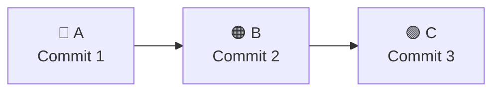
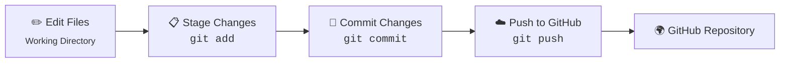

<div align="center">

# Git & GitHub Handbook
### The Complete Beginner's Guide — Master Version Control, Collaborate Better, Code with Confidence


</div>

---

## 📑 Table of Contents

1. [Introduction](#1-introduction)
2. [What is Git?](#2-what-is-git)
3. [Understanding Version Control Systems](#3-understanding-version-control-systems)
4. [Git vs GitHub](#4-git-vs-github)
5. [Installing Git](#5-installing-git)
6. [How Git Works](#6-how-git-works)
7. [Hands-on Git](#7-hands-on-git)
8. [Git Scenario 1: Single User Setup](#8-git-scenario-1-single-user-setup)
9. [Ignoring Files](#9-ignoring-files)
10. [Tracking Empty Directories](#10-tracking-empty-directories)
11. [Branches](#11-branches)
12. [Merge Conflict](#12-merge-conflict)
13. [Stashing in Git](#13-stashing-in-git)
14. [Git Tags](#14-git-tags)
15. [Git Rebase](#15-git-rebase)
16. [Using GitHub to Host Our Repositories](#16-using-github-to-host-our-repositories)
17. [GitHub Desktop](#17-github-desktop)
18. [Using Git in VS Code](#18-using-git-in-vs-code)
19. [Git Scenario 2: Multi-User Setup](#19-git-scenario-2-multi-user-setup)
20. [Modern Workflow](#20-modern-workflow)
21. [Conclusion](#21-conclusion)

---

## 1. Introduction

### Welcome to the **Git & GitHub Handbook** 👋

Learning Git doesn’t have to be hard. This handbook is a **beginner-friendly, practical guide** to help you understand **Git and GitHub from scratch** without the jargon.

If you’ve ever asked **“What is Git?”**, **“What is a commit?”**, or **“How do developers work together on GitHub?”**, you’re in the right place. You’ll find clear explanations, visual diagrams, real-world examples, and copy-paste-ready commands to make learning easy.

By the end of this handbook, you’ll know how to:

- 🚀 Track and manage code with Git.
- 🌿 Create and use branches.
- 🔀 Merge changes and fix conflicts.
- 🤝 Collaborate with others on GitHub.
- 💼 Use real-world Git workflows.

Whether you’re a **student**, **self-taught developer**, **open-source contributor**, or **preparing for your first tech job**, this handbook is for you.

You can use this handbook in two ways:

- 📖 **Learn step by step** by reading it from start to finish.
- 🔍 **Use it as a reference** by jumping to any of the **topics** in the [Table of Contents](#-table-of-contents) whenever you need a quick refresher.

> **⭐ Found this handbook helpful?** Consider starring the repository to support the project, and feel free to open a pull request if you'd like to improve it for the community.

---

## 2. What is Git?

**Git** is a version control system that tracks changes to files over time. It helps you save progress, return
to earlier versions, and work without losing important edits.

Think of Git as a timeline for your project. Each saved point is called a commit. You can review
changes, compare versions, and undo mistakes when needed.

### 📌 A Commit Timeline


```mermaid
flowchart LR
    A["🔴 A<br/>Commit 1"] --> B["🟠 B<br/>Commit 2"] --> C["🟢 C<br/>Commit 3"]
```

> In the above diagram, each letter is one commit. New commits extend the line to the right.

Git is often used with **GitHub**, which gives you a place to store repositories online, share code, and collaborate with others.

### 🚀 Use Git When You Want

<table>
<tr>
<td width="50%">

### 01 📜 Keep a Complete History

A clear history of changes made to your project over time

</td>

<td width="50%">

### 02 💾 Create Reliable Backups

Safe backup points for your work that you can return to anytime.

</td>
</tr>

<tr>
<td>

### 03 🤝 Collaborate with Teams

Easier teamwork when multiple people work on the same project.

</td>

<td>

### 04 🔄 Undo Mistakes Safely

The ability to undo mistakes without losing important edits.

</td>
</tr>
</table>

### 🔄 Visualizing a Simple Git Workflow

| Step | Action | Git Command |
|:---:|:--------|:-----------|
| ✏️ | **Edit Files** | Working Directory |
| ⬇️ | **Stage Changes** | `git add` |
| 💾 | **Create Commit** | `git commit` |
| ☁️ | **Push to GitHub** | `git push` |
| 🌍 | **Repository Updated** | GitHub |


```mermaid
flowchart LR
    A["✏️ Edit Files<br/><sub>Working Directory</sub>"]
    --> B["📋 Stage Changes<br/><code>git add</code>"]
    --> C["💾 Commit Changes<br/><code>git commit</code>"]
    --> D["☁️ Push to GitHub<br/><code>git push</code>"]
    --> E["🌍 GitHub Repository"]
```

---

## 3. Understanding Version Control Systems

Version control systems (VCS) track file changes over time. They let you save snapshots, compare versions, and collaborate without overwriting each other's work.

With version control, you can:

- 📝 Save snapshots of your project.
- 🔍 Compare different versions.
- ⏪ Restore previous versions when needed.
- 🤝 Collaborate with others without overwriting each other's work.

---

### 🏛️ Centralized Version Control System (CVCS)

In a centralized model, one server holds the official copy of the project. Developers check out files, make changes, and check them back in.

### Examples

- SVN (Subversion)
- CVS (Concurrent Versions System)

### Downside

- If the central server goes down, collaboration stops

---

### 🌐 Distributed Version Control System (DVCS)

In a distributed model, every developer has a full copy of the project history on their machine. You commit locally first, then sync with a remote when ready.

### Examples

- Git
- Mercurial

### ✅ Benefit

- You can work offline and still have a full history.

---

## ⚖️ Centralized vs Distributed

| Feature | 🏛️ Centralized VCS | 🌐 Distributed VCS |
|----------|-------------------|--------------------|
| 📜 Project History | Stored only on the server | Stored on every developer's machine |
| 💻 Offline Work | Limited | Full support |
| 💾 Backup | Only the server has the complete history | Every clone acts as a backup |
| ⚠️ Failure Risk | Single point of failure | Multiple copies reduce risk |
| ⚡ Performance | Slower (depends on server) | Faster local operations |

---

## 📊 Visual Comparison

```text
🏛️ Centralized Version Control

            ☁️ Central Server
          ┌─────────────────┐
          │ Project History │
          └────────┬────────┘
          ┌────────┼────────┐
          ▼        ▼        ▼
      👨‍💻 Dev A 👩‍💻 Dev B 👨‍💻 Dev C

```

```text
🌐 Distributed Version Control (Git)

👨‍💻 Dev A      👩‍💻 Dev B      👨‍💻 Dev C
┌──────────┐  ┌──────────┐  ┌──────────┐
│ Full Repo│  │ Full Repo│  │ Full Repo│
│ + History│  │ + History│  │ + History│
└────┬─────┘  └────┬─────┘  └────┬─────┘
     └─────────────┼─────────────┘
                   ▼
          ☁️ Remote Repository
```

---

### 🚀 Why Git Uses a Distributed Model

Git was created by **Linus Torvalds** in **2005** for large teams working on the **Linux Kernel**. A distributed model means:

- ⚡ Faster performance
- 💾 Reliable backups
- 🌿 Easy branching
- 🔀 Powerful merging
- 💻 Offline development
- 🤝 Efficient collaboration

---

### 📝 In Short

- Centralized VCS relies on one server.
- Distributed VCS gives everyone a full copy.
- Git is distributed by design.

---

## 4. Git vs GitHub

**Git** is the version control tool that runs on your computer. It tracks changes, creates commits, and manages branches.

**GitHub** is a website that hosts Git repositories online. It adds collaboration features like pull requests,
issues, and code review.

They are **not** the same thing — Git is the engine, GitHub is one of several places you can park it.

### 📁 Git Repository

A repository (repo) is a project folder tracked by Git. It contains your files plus the hidden **.git** folder with all history. 

---

### 🖥️ Local Repository vs ☁️ Remote Repository

- **Local repo:** on your machine, where you commit daily work.
- **Remote repo:** on GitHub (or similar), where you push and pull to share code.

---

### 📝 In Short

- 📁 A **Git Repository** is a project folder managed by Git.
- 📂 The hidden **`.git`** folder stores your project's complete history.
- 🖥️ A **Local Repository** is where you develop and commit your work.
- ☁️ A **Remote Repository** is where you share, back up, and collaborate on your project.
- 🔄 Use **`git push`** to upload your commits and **`git pull`** to download the latest changes.

### Git vs GitHub Comparison


| | Git | GitHub |
|---|---|---|
| What it is | Tool | Hosting service |
| Runs on | Your computer | The cloud |
| Needs internet | No (for local work) | Yes (to sync) |
| Stores history | Yes | Yes (as a remote copy) |

---

## 5. Installing Git

Before you can start tracking your projects with Git, you need to install it on your operating system. Git is available for **Windows**, **macOS**, and **Linux**, and the installation process only takes a few minutes.

> 💡 **Recommendation:** Always install Git from the **official Git website** to ensure you get the latest stable version.

---

### 🪟 Installing Git on Windows

#### Method 1: Download from the Official Website (Recommended)

1. Visit **https://git-scm.com/downloads**
2. Download the latest version for **Windows**.
3. Run the installer.
4. Leave all settings as **Default** unless you have specific preferences.
5. Click **Next** until the installation is complete.
6. Click **Finish**.

✅ Git is now installed on your computer.

---

#### Method 2: Install Using Winget

If you have **Windows Package Manager (Winget)** installed, open **Command Prompt** or **PowerShell** and run:

```bash
winget install --id Git.Git -e --source winget
```

Wait for the installation to complete.

---

### 🍎 Installing Git on macOS

There are two common ways to install Git on macOS.

#### Method 1: Install Xcode Command Line Tools (Recommended)

Open **Terminal** and run:

```bash
xcode-select --install
```

Follow the on-screen instructions.

Git will be installed automatically along with Apple's Command Line Tools.

---

#### Method 2: Install Using Homebrew

If you already have **Homebrew** installed, simply run:

```bash
brew install git
```

---

### 🐧 Installing Git on Linux

Git is available through your Linux distribution's package manager.

#### Debian / Ubuntu

Update your package list:

```bash
sudo apt update
```

Install Git:

```bash
sudo apt install git
```

---

#### Fedora

```bash
sudo dnf install git
```

---

#### Arch Linux

```bash
sudo pacman -S git
```

---

### ✅ Verify the Installation

After installing Git, open your terminal (or Command Prompt) and run:

```bash
git --version
```

If Git is installed correctly, you'll see output similar to:

```text
git version 2.x.x
```

> 🎉 Congratulations! Git has been successfully installed.

---

### 🛠️ Choosing Your Git Workflow

Once Git is installed, you can use it in different ways depending on your preference.

| Workflow | Best For | Description |
|----------|----------|-------------|
| 💻 **Command Line** | ⭐ Recommended | The most powerful and flexible way to use Git. Works on every platform and supports every Git feature. |
| 📝 **Visual Studio Code** | Daily Development | Use VS Code's built-in **Source Control** panel to manage commits, branches, and repositories without leaving your editor. |
| 🖥️ **GitHub Desktop** | Beginners | A simple graphical interface that lets you use Git without memorizing commands. |

> 💡 **Good to Know:** Regardless of whether you use the **Command Line**, **VS Code**, or **GitHub Desktop**, they all execute the **same Git commands** behind the scenes.

---

### ⚡ Quick Installation Summary

| Platform | Installation Method | Command / Website |
|----------|---------------------|-------------------|
| 🪟 **Windows** | Official Installer | https://git-scm.com/downloads |
| 🪟 **Windows** | Winget | `winget install --id Git.Git -e --source winget` |
| 🍎 **macOS** | Xcode Command Line Tools | `xcode-select --install` |
| 🍎 **macOS** | Homebrew | `brew install git` |
| 🐧 **Debian / Ubuntu** | APT | `sudo apt update && sudo apt install git` |
| 🐧 **Fedora** | DNF | `sudo dnf install git` |
| 🐧 **Arch Linux** | Pacman | `sudo pacman -S git` |

---

## 6. How Git Works

Git moves your changes through **four areas** before they reach GitHub:

---

### The Four Areas of Git

| 📁 | 📋 | 💾 | ☁️ |
|:--:|:--:|:--:|:--:|
| **WORKING DIR** | **STAGING AREA** | **LOCAL REPO** | **REMOTE REPO** |
| Your files on disk | Changes queued for commit | Commits saved locally | GitHub / cloud host |

---

| **01) Working Directory**<br><br>Your project files on disk. Edit freely here. Git sees changes but does not save them until you stage and commit. | **02) Staging Area**<br><br>A holding zone for changes you want in the next commit. Use `git add` to move files here. |
|:---|:---|
| **03) Local Repository**<br><br>Where commits are stored permanently on your machine. Use `git commit` to save a snapshot. | **04) Remote Repository**<br><br>The copy on GitHub (or another host). Use `git push` to upload and `git pull` to download. |

### The Git Workflow

A full cycle from editing to pushing looks like this:

```bash
# 1. Edit files in your working directory

# 2. Stage changes
git add .

# 3. Commit to local repository
git commit -m "describe your change"

# 4. Push to remote repository
git push origin main
```

### Understanding Snapshots

Each commit is a snapshot of your entire project at one moment. Git stores these efficiently so that you can jump back to any point in history.

```bash
# See all snapshots
git log --oneline
```

---

## 7. Hands-on Git

Git provides a simple set of commands for tracking changes, saving versions of your work, and reviewing your project history.

### Basic Git Checks

Before working with Git, you can verify that Git is installed and check the current state of your repository.

```bash
# check installed Git version
git --version

# initialize Git in the current folder
git init

# check the current repository state
git status
```

### Set Your Git Identity

Before making your first commit, configure your name and email address. You usually need to do this only **once per machine**.

```bash
git config --global user.name "Your_Name"
git config --global user.email "Your_Email"
```

You can verify your configuration with:

```bash
git config --global user.name
git config --global user.email
```

---

### 🔑 The Big Four Git Commands

These four commands cover most of your everyday Git workflow:

1. `git status`
2. `git add`
3. `git commit`
4. `git log`

---

### 1. `git status`

Shows the **current state of your repository**.

It tells you which files are:

- Modified
- Staged
- Untracked
- Ready to commit

```bash
git status
```

For a shorter and more compact output:

```bash
git status -s
```

Example:

```text
M  README.md
?? notes.txt
```

Here:

- `M` means the file has been modified.
- `??` means Git is not yet tracking the file.

---

### 2. `git add`

Stages changes so they can be included in your **next commit**.

#### Stage one file

```bash
git add README.md
```

#### Stage multiple files

```bash
git add README.md main.py
```

#### Stage all changes

```bash
git add .
```

#### Stage all files of one type

```bash
git add *.py
```

> **Note:** `git add` does not permanently save your changes. It only moves them into the **staging area**, ready for the next commit.

---

### 3. `git commit`

Creates a **saved snapshot** of your staged changes.

```bash
git commit -m "add README file"
```

A good commit message should briefly explain what changed.

Example:

```bash
git commit -m "fix login validation"
```

You can also stage and commit **already tracked files** in one command:

```bash
git commit -am "fix typo in main script"
```

> **Important:**  
> `git commit -am` only works with files that Git is **already tracking**.  
> New or untracked files must first be staged using `git add`.

Example:

```bash
git add new_file.py
git commit -m "add new Python file"
```

---

### 4. `git log`

Shows the **commit history** of your repository.

#### Full commit history

```bash
git log
```

#### Compact one-line history

```bash
git log --oneline
```

Example:

```text
a1b2c3d add README file
e4f5g6h fix login validation
7h8i9j0 initial commit
```

#### Show the last 5 commits

```bash
git log --oneline -5
```

#### Display branch and merge history as a graph

```bash
git log --oneline --graph --all
```

This is especially useful when working with **multiple branches**.

---

### The Basic Git Lifecycle

A normal Git workflow usually follows this cycle:

```bash
# 1. check what changed
git status

# 2. stage your changes
git add .

# 3. save the staged changes
git commit -m "describe your changes"

# 4. review commit history
git log --oneline
```

**Think of it as:**

`Check → Stage → Save → Review`

---

### More Useful Everyday Commands

#### Unstage a file

Removes a file from the staging area without deleting your changes.

```bash
git restore --staged <filename>
```

Example:

```bash
git restore --staged README.md
```

#### Stage everything

```bash
git add .
```

#### View compact history

```bash
git log --oneline
```

#### View graphical history

```bash
git log --oneline --graph --all
```

---

### Command Reference at a Glance

| Command | What It Does |
|---|---|
| `git init` | Initializes a new Git repository in the current folder. |
| `git status` | Shows staged, modified, and untracked files in the working directory. |
| `git status -s` | Displays a compact summary of the repository state. |
| `git add <filename>` | Stages a specific file for the next commit. |
| `git add .` | Stages all current changes for the next commit. |
| `git add *.py` | Stages all matching `.py` files. |
| `git commit -m "message"` | Creates a new snapshot with a descriptive message. |
| `git commit -am "message"` | Stages tracked modified files and commits them in one step. |
| `git log` | Displays the complete commit history. |
| `git log --oneline` | Displays each commit in a compact one-line format. |
| `git log --oneline -5` | Displays the five most recent commits. |
| `git log --oneline --graph --all` | Visualizes branch and merge history as a graph. |
| `git restore --staged <filename>` | Removes a file from staging while keeping its changes. |

---

## 8. Git Scenario 1: Single User Setup

Let me walk you through a complete project from scratch.

### Complete Walkthrough

**1. Create a Simple Project**

```bash
mkdir hello-git
cd hello-git
git init
echo "# Hello Git" > README.md
````

**2. Make Changes**

```bash
echo "print('hello')" > main.py
git status
```

**3. Stage Files**

```bash
git add README.md
git add main.py

# or stage everything at once
git add .
```

**4. Create a Commit**

```bash
git commit -m "initial commit with readme and main script"
```

---

### Viewing History

```bash
git log --oneline
```

---

### Best Practices While Committing

* Commit when a logical piece of work is done.
* One idea per commit.
* Use present tense messages: `add login form` not `added login form`.

```bash
# good commit flow
git status
git add .
git commit -m "add user input validation"
git log --oneline -3
```

---

### The Full Workflow in One View

Every project follows the same repeating loop: **edit → stage → commit → review**. Repeat this cycle for every logical change.

**EDIT**

Make your changes to files in the working directory. Git notices but does not save them yet.

**STAGE**

Use `git add` to move changes into the staging area, ready to be committed.

**COMMIT**

Use `git commit -m` to save a permanent snapshot with a clear message.

**REVIEW**

Use `git log --oneline` to inspect your commit history and confirm everything looks right.

---

## 9. Ignoring Files

Not every file belongs in Git. Some files should stay local and should never be committed to your repository.

### Why Some Files Should Not Be Tracked

Common examples include:

- Passwords and API keys such as `.env`
- Dependency folders such as `node_modules/`
- Build output such as `dist/` and `build/`
- Python-generated files such as `__pycache__/`
- Operating system files such as `.DS_Store` and `Thumbs.db`
- Large or temporary data files

---

### Understanding `.gitignore`

Create a `.gitignore` file in the root of your repository. Git will ignore files and folders that match the patterns listed inside it.

```bash
touch .gitignore
````

Example `.gitignore` file:

```gitignore
# environment variables
.env

# Python
__pycache__/
*.pyc
venv/

# OS files
.DS_Store
Thumbs.db

# build output
dist/
build/
```

---

### Common `.gitignore` Rules

Ignore a specific file:

```gitignore
secret.txt
```

Ignore a folder and everything inside it:

```gitignore
node_modules/
```

Ignore all files of a specific type:

```gitignore
*.log
```

Ignore all `.log` files but keep one specific file:

```gitignore
*.log
!important.log
```

The `!` symbol means **do not ignore this matching file**.

So:

```gitignore
!important.log
```

means that `important.log` should remain trackable even if `*.log` is ignored above it.

---

### Pattern Reference

| Pattern          | What It Ignores                                                           |
| ---------------- | ------------------------------------------------------------------------- |
| `secret.txt`     | A file named `secret.txt` wherever the pattern matches in the repository. |
| `node_modules/`  | The `node_modules` folder and everything inside it.                       |
| `*.log`          | All files with the `.log` extension.                                      |
| `!important.log` | Keeps `important.log` from being ignored when a previous rule ignores it. |
| `.env`           | The environment file that often contains secrets and API keys.            |
| `__pycache__/`   | Python cache directories.                                                 |
| `*.pyc`          | Compiled Python files.                                                    |
| `dist/`          | Distribution or build output folder.                                      |
| `build/`         | Build output folder.                                                      |

---

### Empty Folders and `.gitkeep`

Git does not track empty folders by itself.

If you want an empty folder to appear in your repository, add a placeholder file such as `.gitkeep`.

```bash
mkdir logs
touch logs/.gitkeep
git add logs/.gitkeep
```

`.gitkeep` is not a special Git feature. It is simply a common convention used to keep otherwise-empty folders in a repository.

---

### Already Tracking a File?

Adding a file to `.gitignore` does not automatically stop Git from tracking it if it was already committed or staged before.

Remove it from Git's tracking while keeping the local file:

```bash
git rm --cached filename
```

Then commit the change:

```bash
git commit -m "stop tracking filename"
```

For example:

```bash
git rm --cached .env
git commit -m "stop tracking .env"
```

The file will remain on your computer, but Git will stop tracking it.

---


## 10. Tracking Empty Directories

Git only tracks **files**, never empty folders. To keep an empty folder (like `logs/`) in your repo:

```bash
mkdir logs
touch logs/.gitkeep
git add logs/.gitkeep
```

---

## 11. Branches

Branches let you work on new features, bug fixes, or experiments without touching your stable code.

### What is a Branch?

A branch is an independent line of development.

In most repositories, `main` is the default branch.

Branching at commit `B` lets you build a feature without changing `main`:

```text
A─B─C        main
   \
    D─E      feature/search
````

Each letter represents a commit.

The lines show how commits are connected, and time flows from left to right.

---

### Why Branches Exist

Branches are useful because:

* They let you build features in isolation.
* They help fix bugs without breaking stable or production code.
* They let you experiment safely.
* They allow multiple lines of development to exist at the same time.

---

### Creating a Branch

Create a new branch with:

```bash
git branch feature/search         # git branch <branchname>
```

This creates the branch, but it does not switch you to it.

---

### Switching Branches

Using the traditional command:

```bash
git checkout feature/search
```

Modern alternative:

```bash
git switch feature/search
```

Both commands move you onto the selected branch.

---

### Creating and Switching Together

You can create a branch and switch to it in one command.

Traditional method:

```bash
git checkout -b feature/search
```

Modern alternative:

```bash
git switch -c feature/search
```

The `-c` option tells Git to create the branch before switching to it.

---

### Viewing Branches

Show all local branches:

```bash
git branch
```

Example:

```text
* feature/search
  main
```

The `*` symbol shows your current branch.

Show local and remote branches:

```bash
git branch -a
```

Show only the name of your current branch:

```bash
git branch --show-current
```

Example:

```text
feature/search
```

---

### Understanding the Git Graph

You can visualize how branches split and merge with:

```bash
git log --oneline --graph --all
```

A typical branch history may look like:

```text
      D─E
     /   \
A─B─C─────M
```

Here:

* `A`, `B`, and `C` are commits on the original line of development.
* `D` and `E` represent work done on another branch.
* `M` is a merge commit where the two lines of development come back together.

This graph helps you understand how branches have changed and merged over time.

---

## 12. Merge Conflict

Merge conflicts happen when Git cannot automatically combine changes made to the same lines of a file.

### Why Conflicts Happen

Common causes include:

- Two people edit the same line of a file.
- You edit a file locally while someone else pushes changes to the same part.
- You merge branches that contain overlapping edits.
- You rebase a branch that has conflicting changes.

For example, both branches may change the same line after splitting from the same commit:

```text
      C   feature/search changed line 10
     /
A─B─E    main also changed line 10
````

Both branches changed the same part of the file after commit `B`.

Git cannot decide automatically which version should be kept, so it reports a **merge conflict**.

---

### Resolving a Merge Conflict

Try to merge the branch:

```bash
git merge feature/search
```

If Git finds conflicting changes, you may see output similar to:

```text
CONFLICT (content): Merge conflict in filename.py
```

Open the conflicted file and Git will show special conflict markers.

---

### Conflict Markers

A conflicted file may look like this:

```text
<<<<<<< HEAD
your version
=======
their version
>>>>>>> feature/search
```

The markers mean:

* `<<<<<<< HEAD` shows the version from your current branch.
* `=======` separates the two conflicting versions.
* `>>>>>>> feature/search` shows the version from the branch being merged.

Edit the file manually and keep the correct code.

Then remove all conflict markers:

```text
<<<<<<< HEAD
=======
>>>>>>> feature/search
```

After resolving the file, stage it:

```bash
git add filename.py
```

Then create a commit:

```bash
git commit -m "resolve merge conflict in filename.py"
```

---

### Understanding `git diff`

`git diff` helps you inspect changes before committing them.

It can compare different areas of your Git workflow.

```text
Working Directory → Staging Area → Repository
```

#### View Unstaged Changes

Compare your working directory with the staging area:

```bash
git diff
```

This shows changes you have made but have not staged yet.

---

#### View Staged Changes

Compare the staging area with the last commit (`HEAD`):

```bash
git diff --staged
```

This shows changes that have already been staged with `git add`.

---

#### View Changes in a Specific File

```bash
git diff filename.py
```

During a merge conflict, this can help you inspect conflicting changes in a specific file.

---

### Quick `git diff` Reference

| Command                | What It Compares                     |
| ---------------------- | ------------------------------------ |
| `git diff`             | Working directory vs staging area    |
| `git diff --staged`    | Staging area vs last commit (`HEAD`) |
| `git diff filename.py` | Changes in a specific file           |

---

### Best Practices to Avoid Conflicts

Pull the latest changes before starting work:

```bash
git pull origin main
```

Before pushing your work, make sure your local branch is updated:

```bash
git pull origin main
git push origin main
```

Other good practices include:

* Keep feature branches short-lived.
* Commit and synchronize changes regularly.
* Communicate with teammates when working on the same files.
* Avoid making large unrelated changes in the same commit.

---

### Abort a Merge if You Are Stuck

If you are in the middle of a merge conflict and want to cancel the merge:

```bash
git merge --abort
```

`git merge --abort` stops the in-progress merge and attempts to return your files to the state they were in before you ran:

```bash
git merge
```

---

## 13. Stashing in Git

Git stash saves uncommitted work temporarily so you can switch tasks without creating a half-finished commit.

### Why Git Stash Exists

Suppose you are working on a feature, but suddenly need to fix an urgent bug on `main`.

Instead of committing unfinished work, you can temporarily store your changes using Git stash.

```text
Working on feature
      ↓
git stash
      ↓
Switch branch / fix bug
      ↓
Return to feature
      ↓
git stash pop
````

---

### Saving Work Temporarily

Save your current uncommitted changes:

```bash
git stash
```

You can also add a message so you remember what the stash contains:

```bash
git stash push -m "wip on search feature"
```

This temporarily stores your work and gives you a cleaner working directory.

---

### Viewing Stashes

To see all saved stashes:

```bash
git stash list
```

Example:

```text
stash@{0}: On feature/search: wip on search feature
stash@{1}: On feature/login: half-done login form
```

Each stash receives an identifier such as:

```text
stash@{0}
stash@{1}
```

---

### Restoring a Stash

Apply the most recent stash:

```bash
git stash apply
```

This restores the changes but keeps the stash in the stash list.

To apply a specific stash:

```bash
git stash apply stash@{1}
```

---

### Applying vs Popping

`git stash apply` restores the saved changes but keeps the stash:

```bash
git stash apply
```

`git stash pop` restores the saved changes and removes the stash from the list:

```bash
git stash pop
```

In simple terms:

```text
git stash apply → restore + keep
git stash pop   → restore + remove
```

---

### Real-World Example

Suppose you are working on a login feature but need to fix an urgent issue on `main`.

First, save your unfinished work:

```bash
git stash push -m "half-done login form"
```

Switch to `main`:

```bash
git switch main
```

Create a branch for the urgent fix:

```bash
git switch -c hotfix/typo
```

Fix the issue, commit it, and complete your work.

Then return to your feature branch:

```bash
git switch feature/login
```

Restore your saved work:

```bash
git stash pop
```

You can now continue working from where you stopped.

---

### Deleting a Stash

If you no longer need a specific stash:

```bash
git stash drop stash@{0}
```

This permanently removes that stash from the list.

---

### Clearing All Stashes

To remove every saved stash:

```bash
git stash clear
```

Be careful with this command because it removes all stashes.

---

### Quick Command Reference

| Command                       | What It Does                                            |
| ----------------------------- | ------------------------------------------------------- |
| `git stash`                   | Temporarily saves current uncommitted changes.          |
| `git stash push -m "message"` | Saves changes with a descriptive label.                 |
| `git stash list`              | Shows all saved stashes.                                |
| `git stash apply`             | Restores the latest stash and keeps it in the list.     |
| `git stash apply stash@{1}`   | Restores a specific stash.                              |
| `git stash pop`               | Restores the latest stash and removes it from the list. |
| `git stash drop stash@{0}`    | Deletes a specific stash.                               |
| `git stash clear`             | Deletes all saved stashes.                              |

---

## 14. Git Tags

Git tags mark important points in your repository history, usually releases.

### Why Tags Exist

Git tags are useful for:

- Marking version releases such as `v1.0.0`
- Bookmarking stable checkpoints
- Referencing a specific commit permanently

Unlike branches, tags do not move when new commits are added.

Example:

```text
A─B─C─D
    ↑   ↑
 v1.0.0 main
````

After adding more commits:

```text
A─B─C─D─E─F
    ↑       ↑
 v1.0.0    main
```

`v1.0.0` stays on commit `C`, while `main` continues moving forward.

---

### Lightweight Tags

A lightweight tag is a simple pointer to a commit.

It does not store extra metadata such as an author, date, or message.

```bash
git tag v1.0.0
```

---

### Annotated Tags

Annotated tags are recommended for releases.

They store additional information such as:

* Author
* Date
* Tag message

Create an annotated tag:

```bash
git tag -a v1.0.0 -m "first stable release"
```

---

### Creating Tags

Tag the current commit:

```bash
git tag v1.0.0
```

Tag a specific commit:

```bash
git tag v0.9.0 a1b2c3d
```

Create an annotated tag with a message:

```bash
git tag -a v1.0.0 -m "release version 1.0.0"
```

---

### Listing Tags

List all tags:

```bash
git tag
```

List tags matching a specific pattern:

```bash
git tag -l "v1.*"
```

View details about a tag:

```bash
git show v1.0.0
```

---

### Pushing Tags to GitHub

Tags are not automatically pushed with normal commits.

Push one specific tag:

```bash
git push origin v1.0.0
```

Push all local tags:

```bash
git push origin --tags
```

---

### Deleting Tags

Delete a tag locally:

```bash
git tag -d v1.0.0
```

Delete the same tag from GitHub:

```bash
git push origin --delete v1.0.0
```

---

### Lightweight vs Annotated Tags

| Type        | Use Case                                                   |
| ----------- | ---------------------------------------------------------- |
| Lightweight | Simple pointer to a commit with no extra metadata          |
| Annotated   | Stores author, date, and message; recommended for releases |

---

## 15. Git Rebase

Git rebase moves your branch commits on top of another branch to create a cleaner and more linear history.

### What is Rebase?

Instead of creating a merge commit, `git rebase` replays your commits on top of the latest commits from another branch.

Suppose your feature branch diverged from `main` at commit `B`.

Your feature branch has commits `C` and `D`, while `main` has moved forward to commit `E`:

```text
      C─D        feature/search
     /
A─B─E            main
````

After running:

```bash
git switch feature/search
git rebase main
```

Git replays your feature commits on top of `E`:

```text
A─B─E─C'─D'
    ↑       ↑
   main   feature/search
```

`C'` and `D'` are new commits containing the same changes as `C` and `D`, but they are now based on the latest `main`.

---

### Rebase vs Merge

A merge keeps the original branch structure and creates a merge commit.

```text
      C─D
     /   \
A─B─E─────M
```

Here, `M` is the merge commit.

A rebase instead replays your work on top of the updated branch:

```text
A─B─E─C'─D'
```

This creates a straight, linear history without an extra merge commit.

---

### Merge vs Rebase

|                         | Merge                      | Rebase             |
| ----------------------- | -------------------------- | ------------------ |
| History                 | Preserves branch structure | Linear and cleaner |
| Merge commit            | Yes                        | No                 |
| Safe on shared branches | Yes                        | No                 |

---

### When to Use Rebase

Rebase is useful:

* Before opening a pull request to keep your branch history clean
* To sync a feature branch with the latest changes from `main`
* On branches that only you are working on

Example:

```bash
# update your feature branch with the latest main

git switch feature/search
git fetch origin
git rebase origin/main
```

This fetches the latest remote changes and replays your feature commits on top of the latest `origin/main`.

---

### Rebasing Before a Pull Request

Before pushing your feature branch for a pull request:

```bash
git switch feature/search
git rebase main
git push --force-with-lease origin feature/search
```

Because rebase rewrites commit history, a normal push may be rejected.

`--force-with-lease` safely updates the remote branch while checking that no unexpected remote changes have been added.

---

### Best Practices

* Rebase branches that only you are working on.
* Rebase your feature branch before opening a pull request if you want a cleaner history.
* Never rebase commits that have already been pushed to a shared branch.
* Remember that rebase creates new versions of your commits.

---

### Abort a Rebase

If the rebase becomes difficult or you want to cancel it:

```bash
git rebase --abort
```

This stops the current rebase and returns your branch to the state it was in before the rebase started.

---

### Important Rule

> ⚠️ Never rebase commits that have already been pushed to a shared branch.

Rebase rewrites commit history, so changing commits that other developers are already using can cause synchronization problems.

---

## 16. Using GitHub to Host Our Repositories

1. Sign up at [github.com](https://github.com).
2. Create a repository (with an optional **README.md** — GitHub's "front door" for your project).

```bash
git clone <URL>                        # download a repo (public: easy; private: needs SSH key)
git remote add origin <URL>            # connect local repo to GitHub
git remote -v                          # see connected remotes
git branch -M main                     # rename branch to main
git config --global init.defaultBranch main  # set default for all new repos
git push origin main                   # upload your commits
git pull                               # download + merge remote changes
git fetch                              # download without merging
```

- **origin** → the default nickname for your remote URL
- **main** → the default primary branch name

---

## 17. GitHub Desktop

A free **GUI for Git and GitHub** — clone, commit, branch, push, and pull with buttons instead of commands.

- 🌐 Public repos are viewable by anyone, even in incognito. Private repos show a 404 to outsiders.
- **Pull Request (PR):** a request to merge someone's proposed changes into your project.
- **Forking:** create your own copy of someone else's repo to freely edit, then open a PR back to contribute.
- ⭐ **Starring** = GitHub's "like" button.

> 🎯 **Pro tip:** Practice with a friend — create a sandbox repo, push/pull, branch, and open PRs on each other's code.

---

## 18. Using Git in VS Code

- `Ctrl+Shift+G` (Win/Linux) or `Cmd+Shift+G` (Mac) opens the **Source Control** panel.
- Click `+` to stage a file, `-` to unstage, type a message, and hit ✓ to commit.
- Click the sync icon to pull + push in one step.

**Recommended extension — Git Graph:**
```
Extensions → search "Git Graph" → Install
Ctrl+Shift+P → "Git Graph: View Git Graph"
```

---

## 19. Git Scenario 2: Multi-User Setup

**Invite collaborators** via repository Settings, then use **Issues** to track work:

| Field | Purpose |
|---|---|
| Title | Short summary |
| Description | Full details |
| Assignees | Who's responsible |
| Labels | Category (bug, enhancement...) |
| Project / Milestone | Groups issue under bigger goals |
| Development | Links a branch/PR to the issue |

> 💬 Issues work like a social feed — comment, react, and close once resolved.

**Team branch workflow:**
```bash
git checkout -b feature/login       # 1. create & switch to a feature branch
git add .
git commit -m "add login page"      # 2. make changes and commit
git push -u origin feature/login    # 3. push and open a pull request
```

---

## 20. Modern Workflow

- 🤖 **AI-generated commit messages** — many tools (including VS Code) can draft one for you from your diff.
- 🌿 **Branch-per-experiment** — trying 4 different approaches? Make 4 branches, merge only the one that works.

```bash
git switch -c feature/todays-work
git add .
git commit -m "describe each logical step"
git push -u origin feature/todays-work
```

---

## 21. Conclusion

### ✅ Best Practices
- **Present tense commit messages** — `"Fix login bug"`, not `"Fixed login bug"`
- **Meaningful messages** — describe *what* and *why*, not "fixed stuff"
- **Short-lived branches** — merge back to main as soon as it's ready
- **Never push secrets** — no passwords, `.env` files, or API keys (once leaked, rotate them immediately)
- **Always review before committing** — `git status` and `git diff` catch mistakes early

### ⚡ Quick Reference Cheat Sheet

| Command | What it does |
|---|---|
| `git init` | Start a new repository |
| `git clone <url>` | Copy a remote repository |
| `git status` | Check current state |
| `git add .` | Stage all changes |
| `git commit -m "msg"` | Save a snapshot |
| `git log --oneline` | Compact commit history |
| `git branch -a` | List all branches |
| `git switch -c <name>` | Create + switch to a branch |
| `git merge <branch>` | Merge a branch into current |
| `git stash` / `git stash pop` | Park & restore uncommitted work |
| `git push` / `git pull` | Sync with GitHub |
| `git reset --hard HEAD~1` | Undo last commit (⚠️ discards changes) |
| `git revert <commit>` | Safely undo a **pushed** commit |

---

<div align="center">

### 🎉 You now have a complete, practical foundation in Git & GitHub.
**The best way to lock it in: open a terminal right now and try every command above.**

</div>
